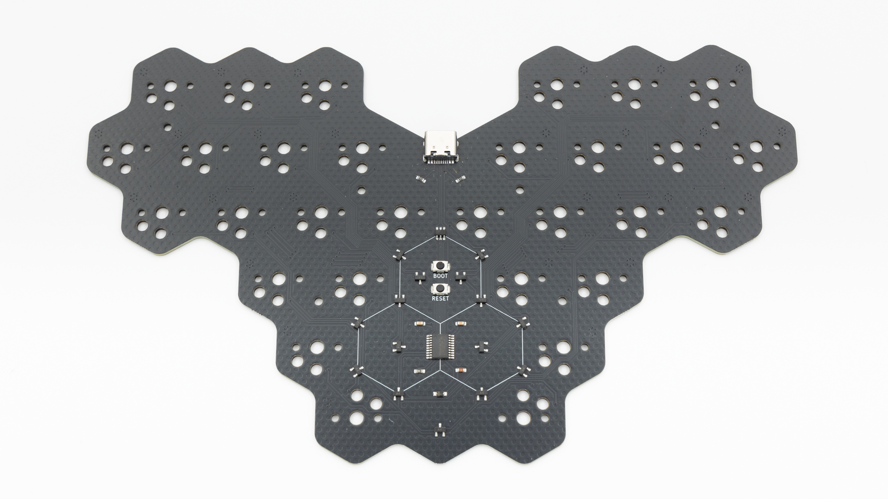
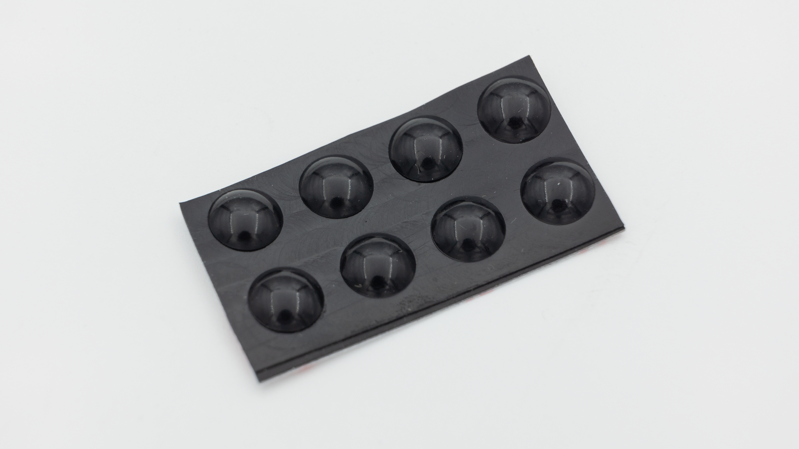
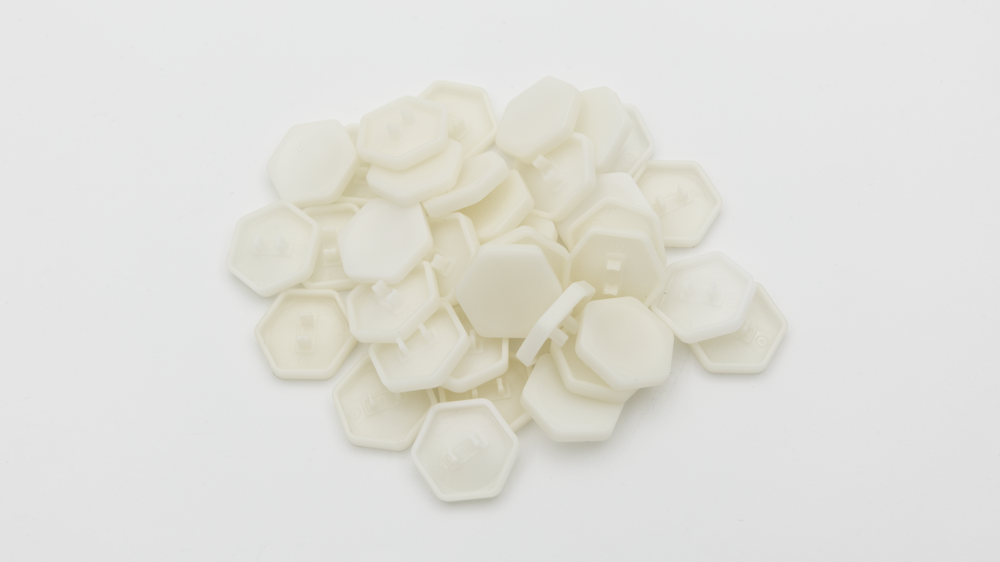
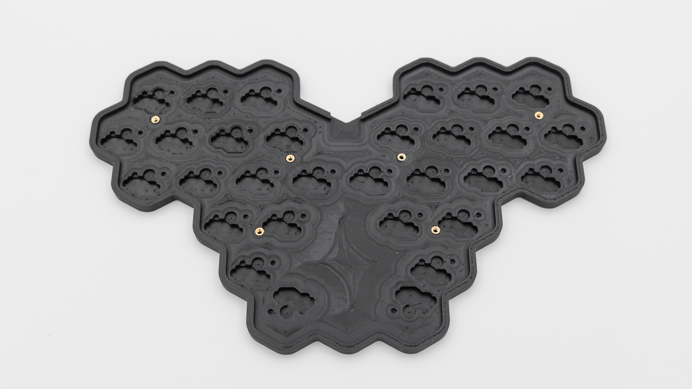
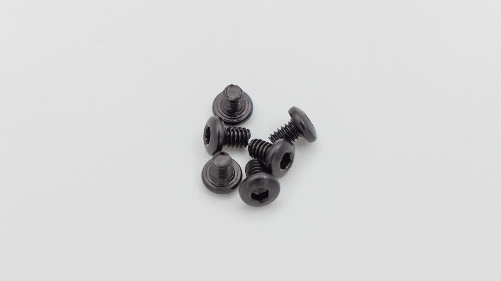

## Kit

| Image                         | Description     | Quantity |
| ----------------------------- | --------------- | -------- |
|                               |
|       | PCB             | 1        |
|  | HotSwap Sockets | 30       |
|   | Rubber Feet     | 8        |
|      | Hex Keycaps     | 30       |

## Case

These components are only included if you buy the case.
| Image | Description | Quantity |
| ----------- | ------------------------------------------- | -------- |
| |
|  | 3DP-Case with heat set inserts preinstalled | 1 |
|  | Screws | 6 |
