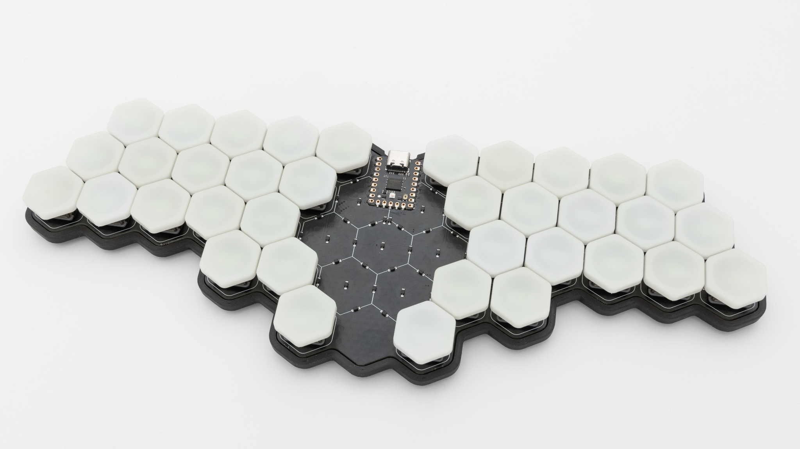

## Soldering

If you do not have experience with soldering, please refer to this [quick start guide]().

### Controller

When you buy the Hexatana kit through KeebSupply you will receive a preflashed 0xCB Gemini controller. If you want you can test your controller before soldering it in. Just plug it in to your computer and see if it pops up in [VIAL]().

 If your controller is working, you can solder it in. Instructions on how to do that can be found [here](). Place the PCB in front of you, with the side that the diodes are on facing upwards. Place the controller onto the PCB with the USB port also facing upwards.



 When you have your controller soldered in, it is good practice to do a [matrix test]() in VIAL. Use tweezers or other metallic objects for this and short the pads of each key.

If all of the keys are working properly, you can go ahead and continue with the assembly!

### HotSwap Sockets

You have to solder in HotSwap Sockets. You can find instructions for that [here]().

 This is everything you need to solder!

## Final Assembly

 If you have decided to get the 3D printed case, place the board into the case from the top and screw in the screws through the holes above the heat set inserts.

 Place the rubber feet onto your PCB or if you use a case onto your 3D-Printed case.

 After that push in the switches.

 Then put on your keycaps.

 After that your Hexatana is done!
