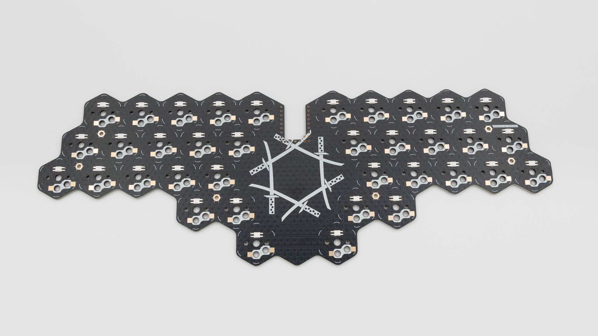
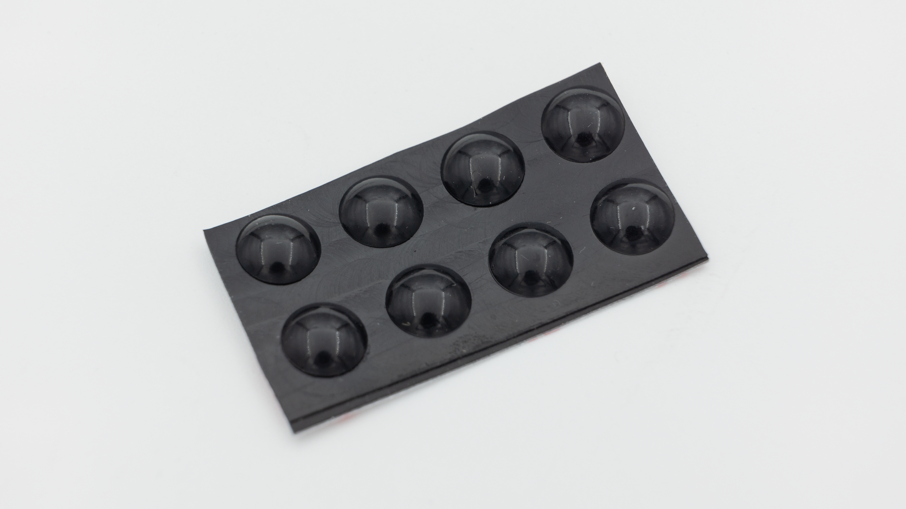
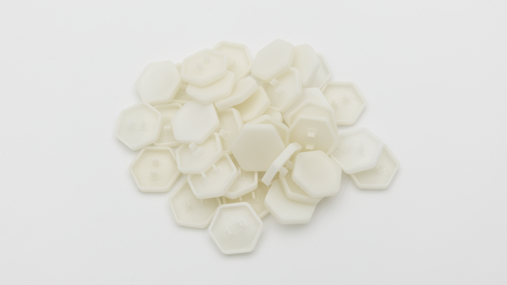
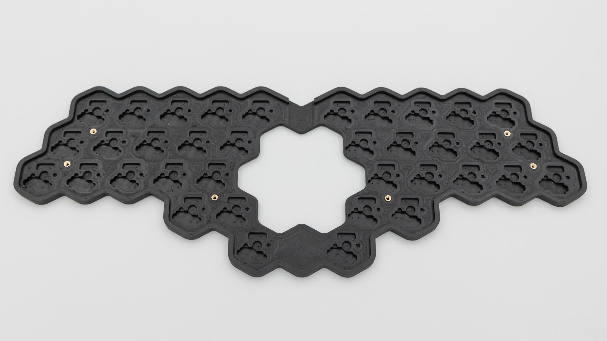
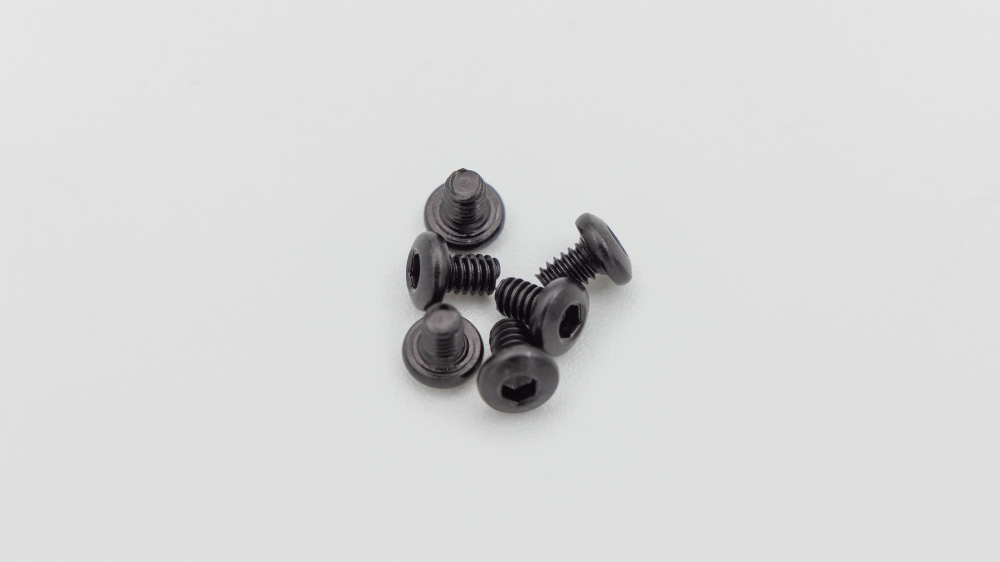

## Kit

| Image                         | Description            | Quantity |
| ----------------------------- | ---------------------- | -------- |
|                               |
|       | PCB                    | 1        |
|          | 0xCB Gemini Controller | 1        |
|  | HotSwap Sockets        | 40       |
|   | Rubber Feet            | 8        |
|      | Hex Keycaps            | 36       |

## Case

These components are only included if you buy the case.
| Image | Description | Quantity |
| ----------- | ------------------------------------------- | -------- |
| |
|  | 3DP-Case with heat set inserts preinstalled | 1 |
|  | Screws | 6 |
