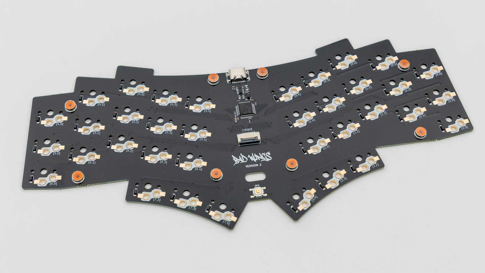
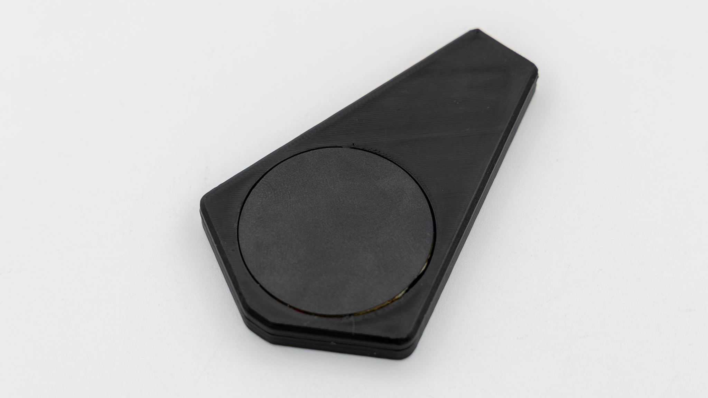
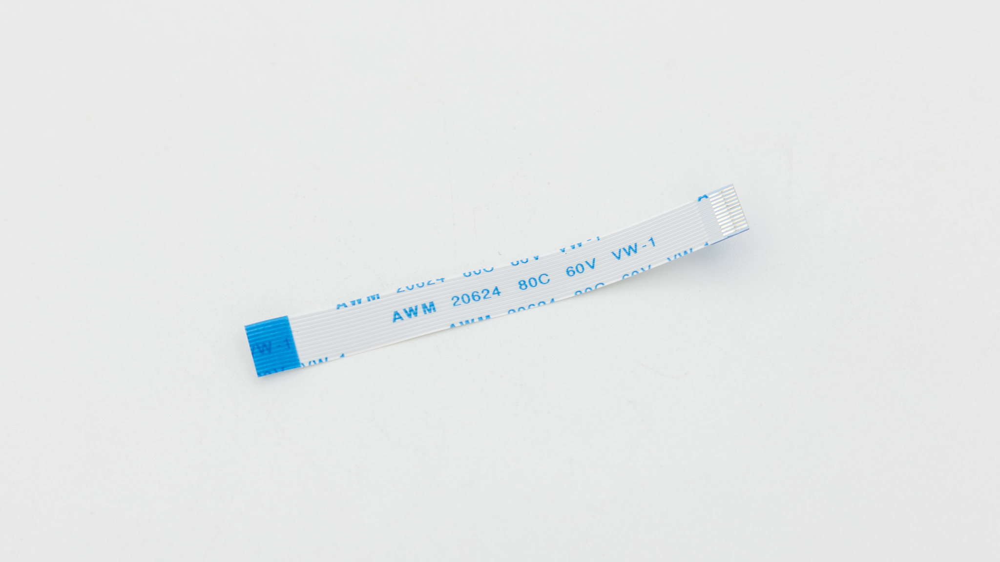
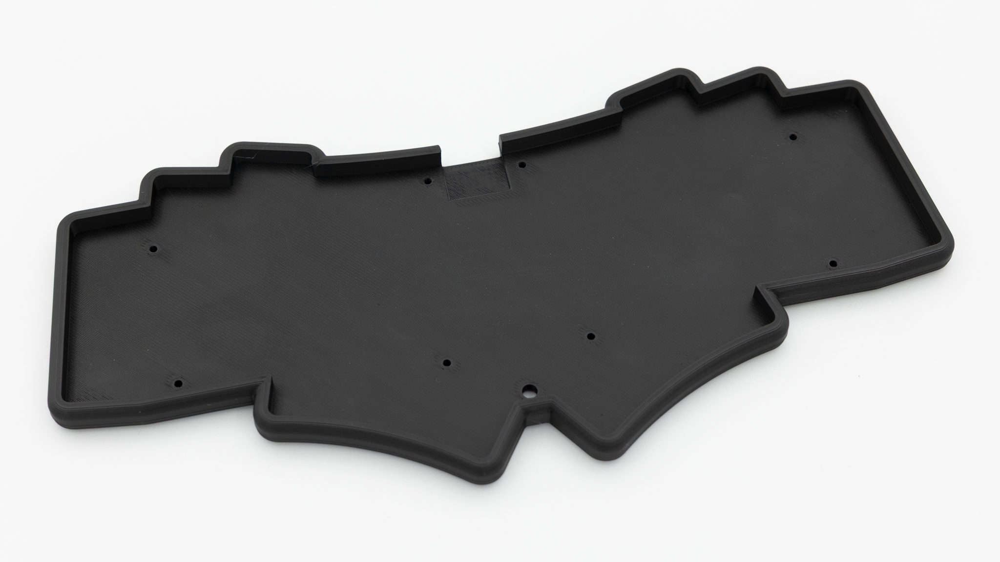
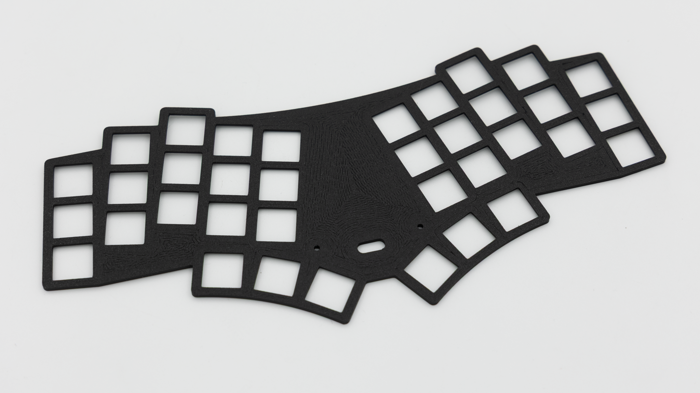
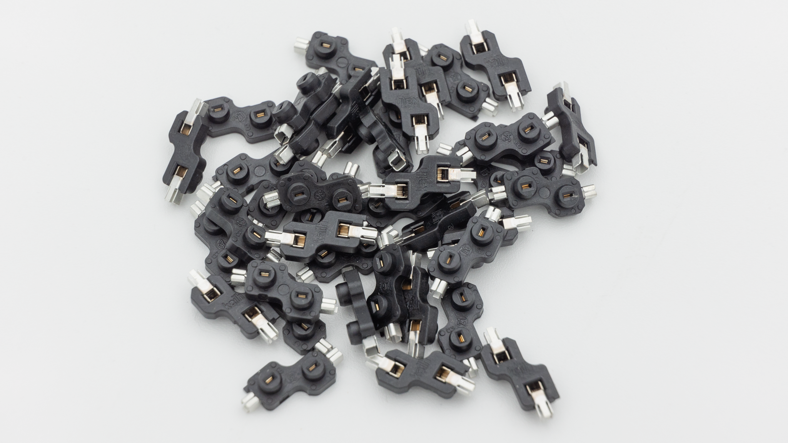
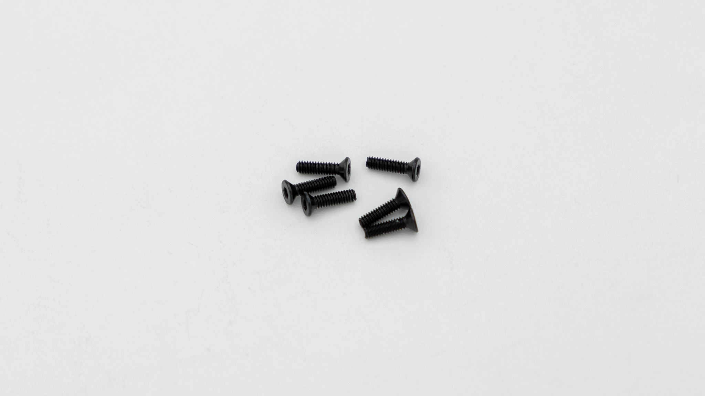
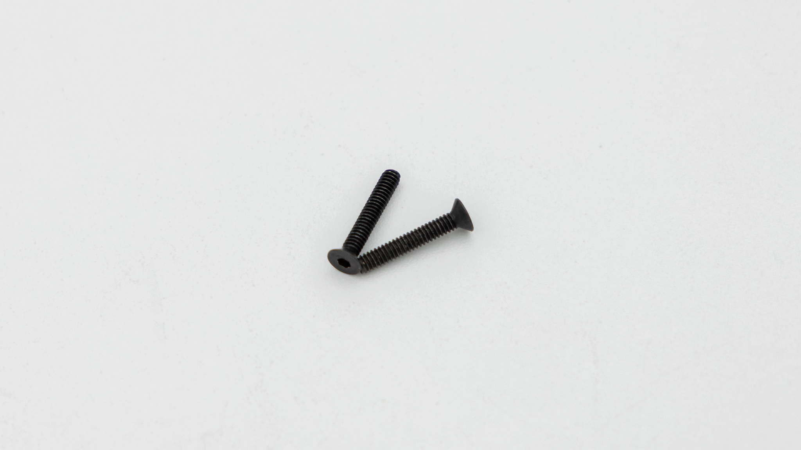

| Image                            | Description                 | Quantity |
| -------------------------------- | --------------------------- | -------- |
|                                  |
|                   | PCB with onboard controller | 1        |
|          | Rubber Feet                 | 8        |
|    | Cirque trackpad assembly    | 1        |
|             | Trackpad Cable              | 1        |
|                 | 3D-Printed case             | 1        |
|               | 3D-Printed plate            | 1        |
|     | HotSwap Sockets             | 40       |
|  | M2x8mm screws               | 6        |
|    | M2x12mm screws              | 2        |
