## Soldering

If you do not have experience with soldering, please refer to this [Quick Start guide]().

All of the following steps need to be executed on both halves of the keyboard. This will not be pointed out every time again in the following instructions.


Since the Nomad has a reversible PCB that is the same on both sides, we suggest having both PCBs next to each other with the top side also facing up. Make sure that you do not confuse them and to put all of the pieces on the correct side.


### Reset Buttons

Solder on the reset buttons to the top of the PCB.
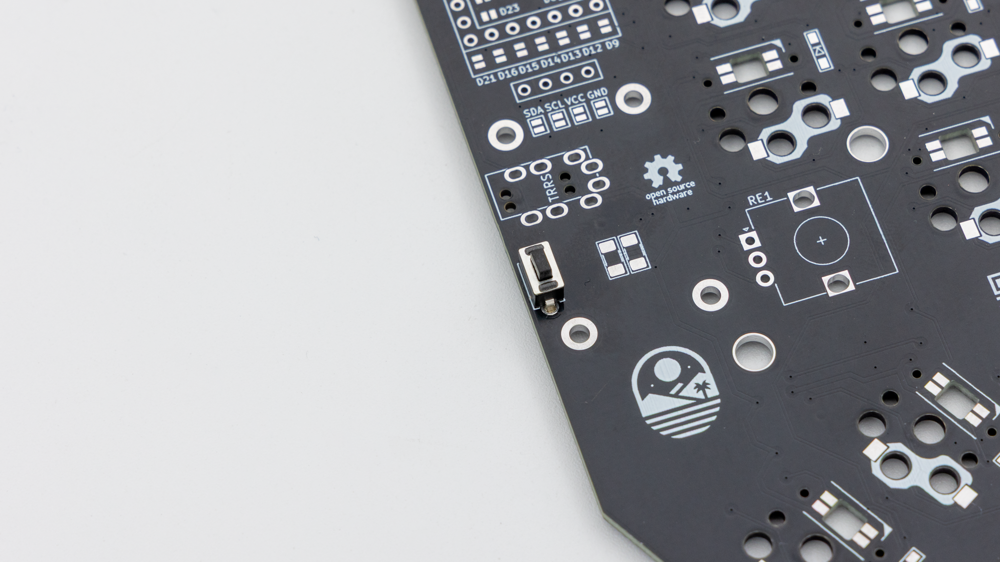

### TRRS Jacks

You will need to solder in the TRRS jacks on the same side as the reset button.
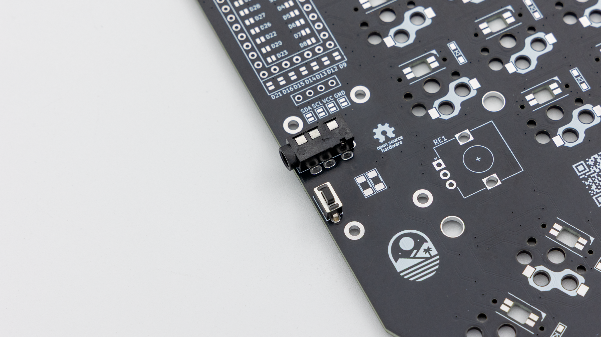

### Jumper

To make the reversible PCB work you need to connect jumpers on both halves. Connect all of the marked jumpers around the controller on the same side where the TRRS jack and reset button are located.
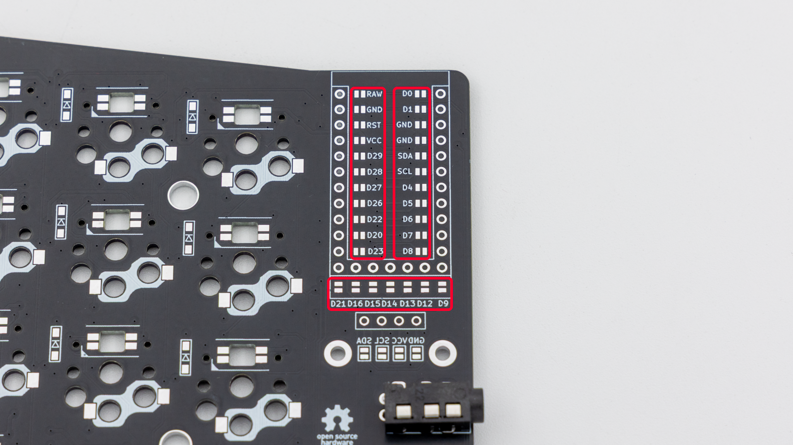

### Hotswap Sockets


Turn around both PCBs now!

Solder the hotswap sockets onto the back of the PCB. You can find instructions for that [here]().
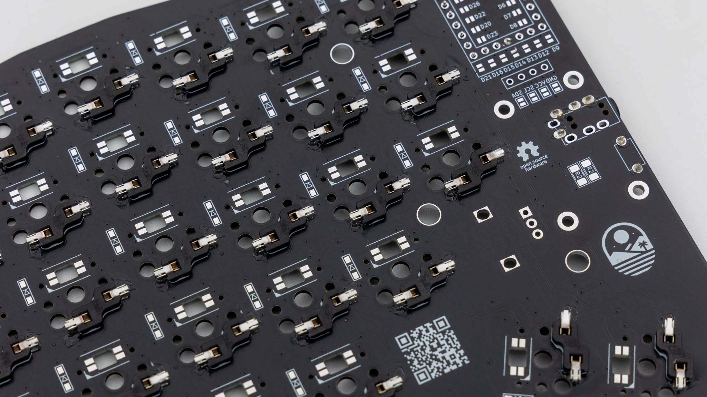

### Diodes

Solder the diodes to the same side as the hotswap sockets. Read through [here]() if you have not done that before.
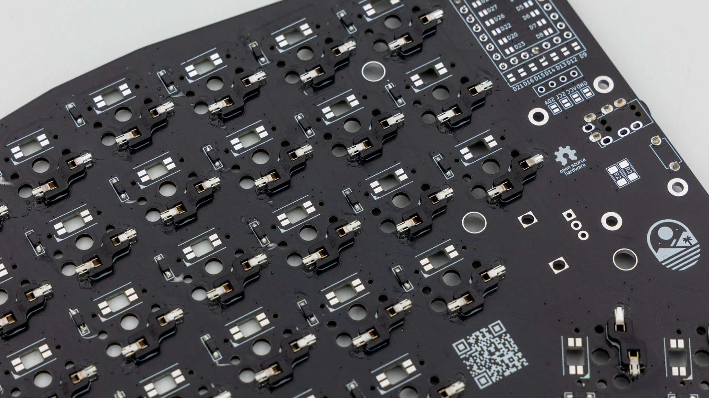

### Controller Standoffs


Turn around both PCBs now!

Next solder the standoffs for your controller. They go on the same side as the TRRS jack and reset button. Read through [here]() if you have not done that before.
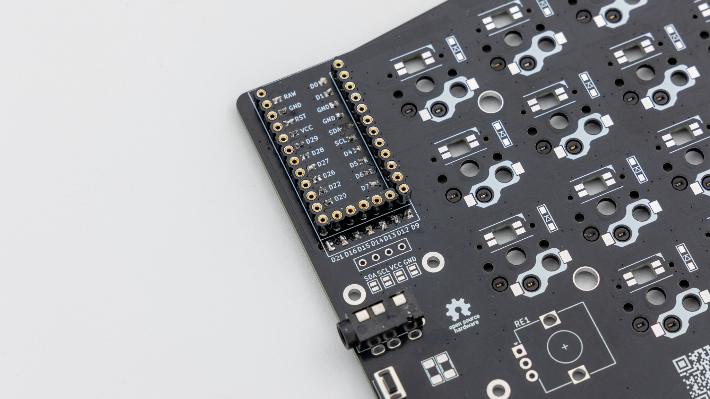

### Controller

Before soldering the controllers onto the PCB we should get your controller flashed.
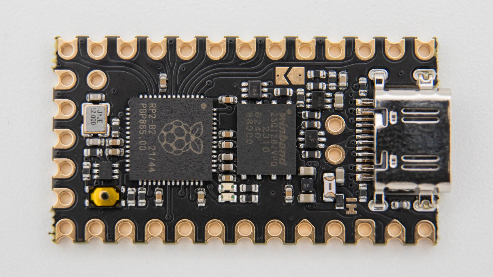

You can find the firmware <a href="https://files.keeb.supply/firmware/Nomad/" >here<a>. And instructions on how to flash a controller [here](). 

Plug in your controller now and see if it pops up in [VIAL]().
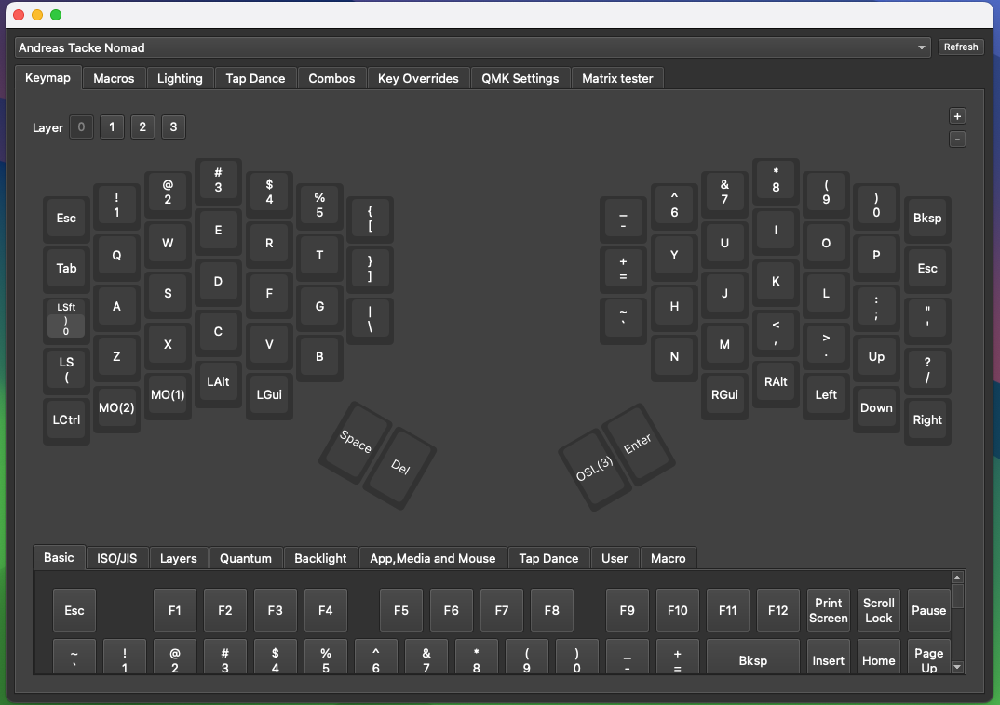

If it does you have successfully flashed your controller.

If your controller is working, you can solder it in. Instructions on how to do that can be found [here](). When you have the PCB in front of you, the USB port should go to the top of the PCB. You should not see the components of the controller, when it is sitting on the PCB.
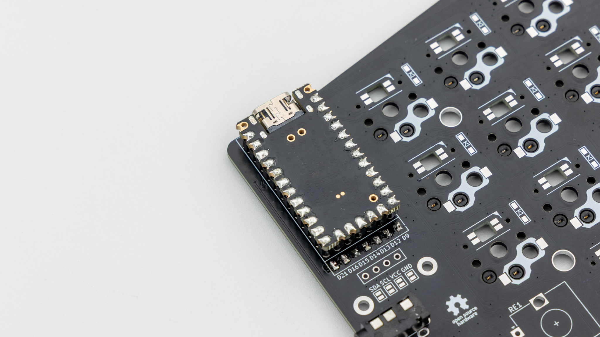

When you have your controller soldered in, it is good practice to do a [matrix test](). Since the Nomad is a split keyboard, you need to plug in the two halves together using the TRRS cable.

Do not hotplug the TRRS cable, when your controllers are plugged into your PC. This can and will damage the board. Always unplug the keyboard from the PC, before plugging the TRRS cable in/out.

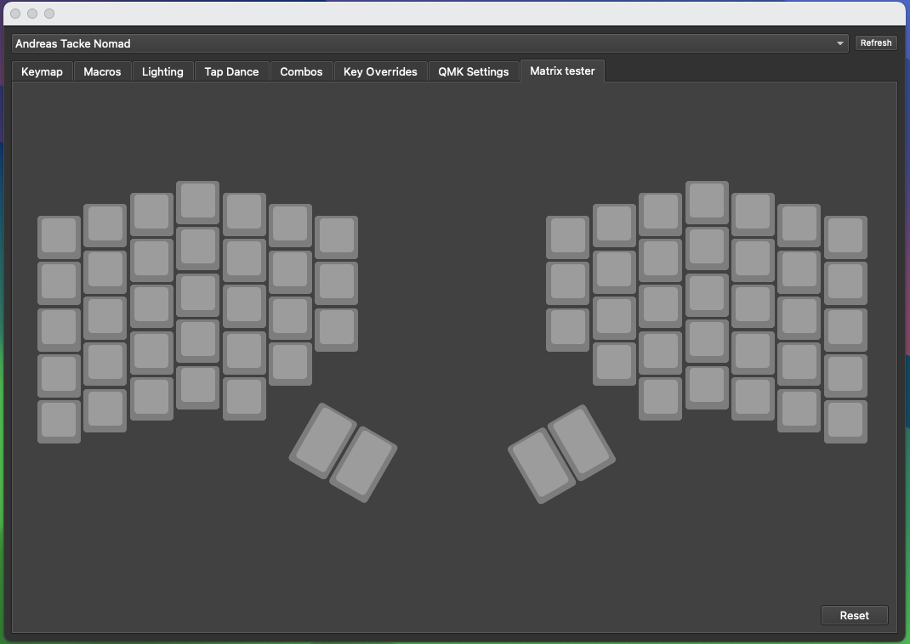

## Final Assembly

Start by putting on the rubber feet. We provide 4 feet per side which you can place wherever you want.
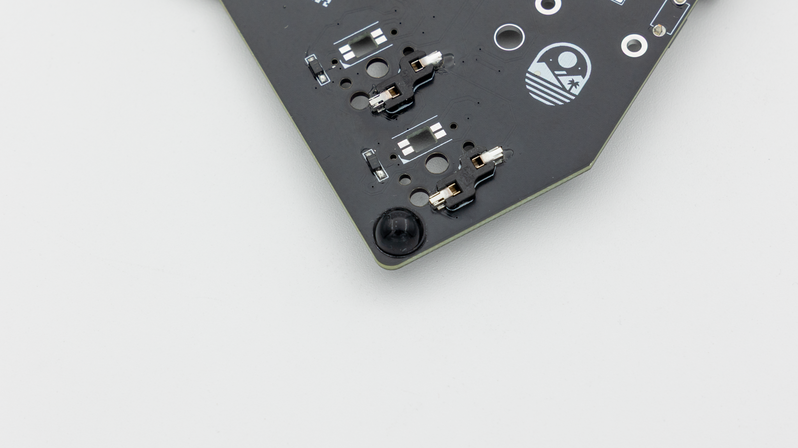

After that put the PCB inside the case.
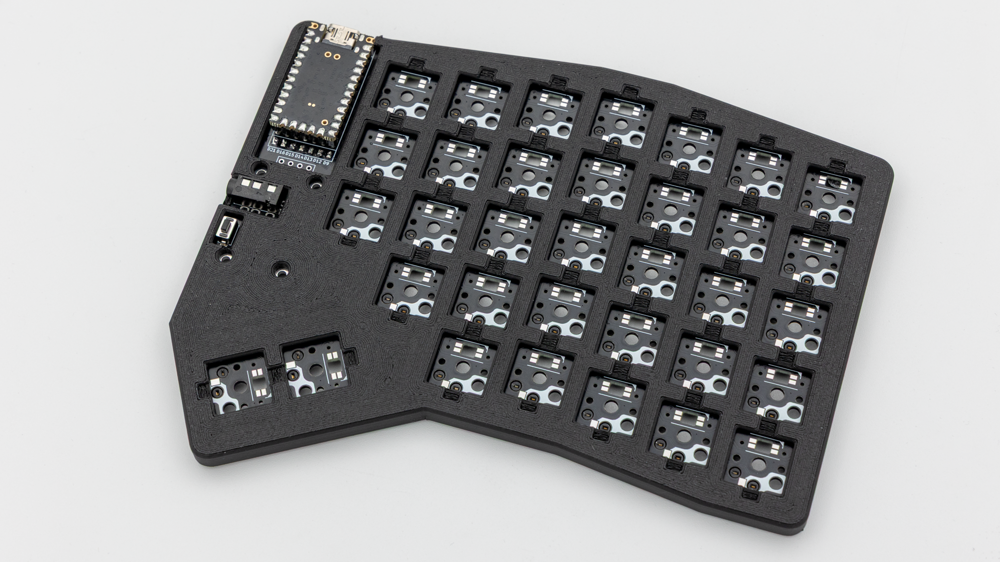

Insert the switches through the case into the PCB.
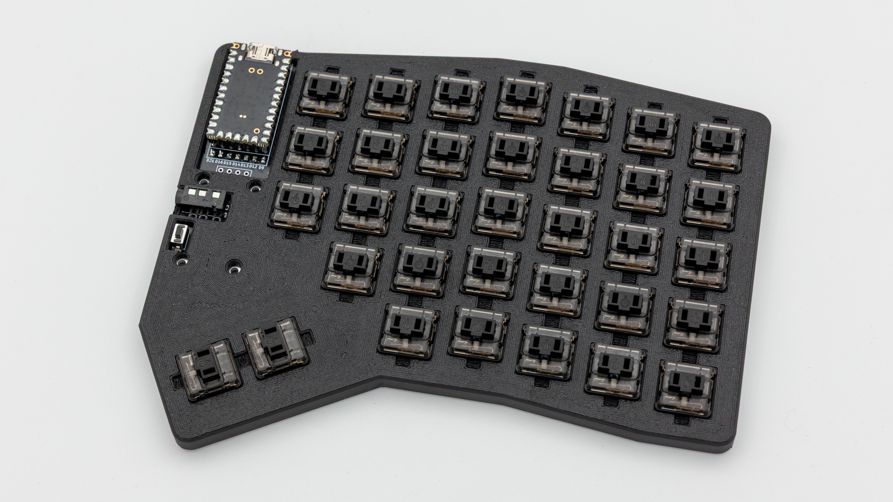

Screw the standoffs into the PCB.
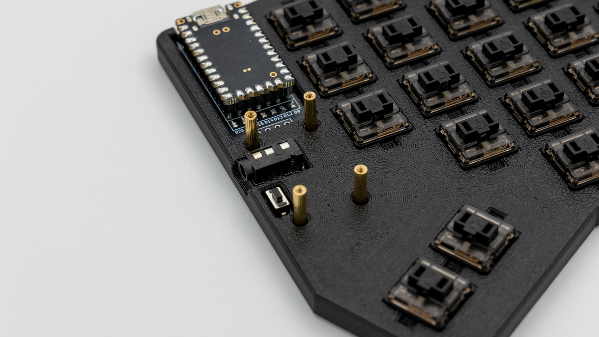

Remove the protective film from the acryl, lay it ontop of the standoffs and put screws into them.
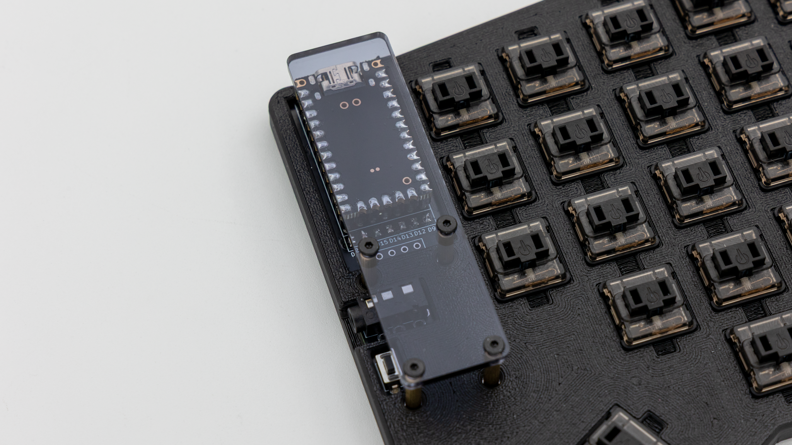

Put on keycaps.
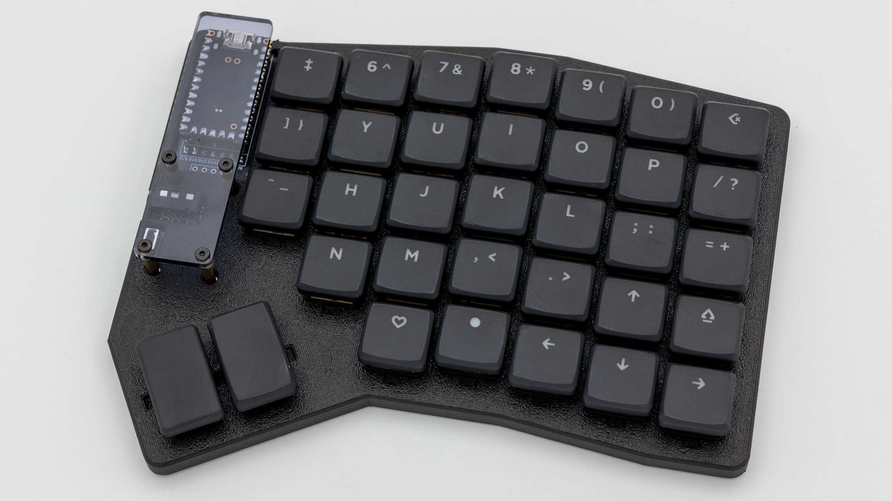

And your Nomad keyboard is done!
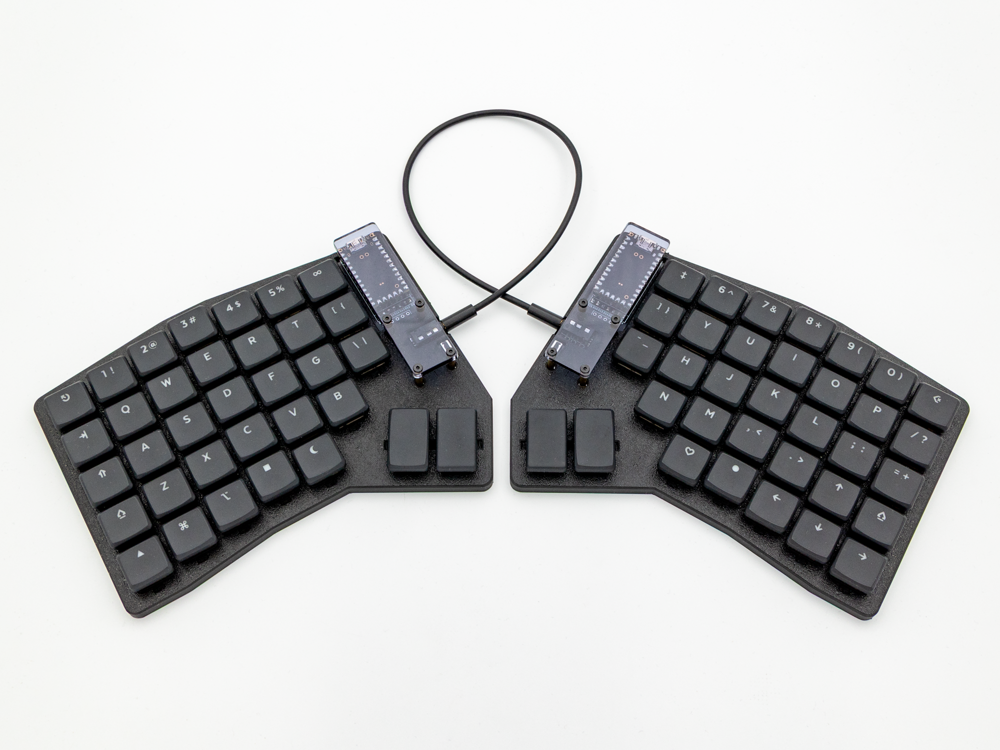
