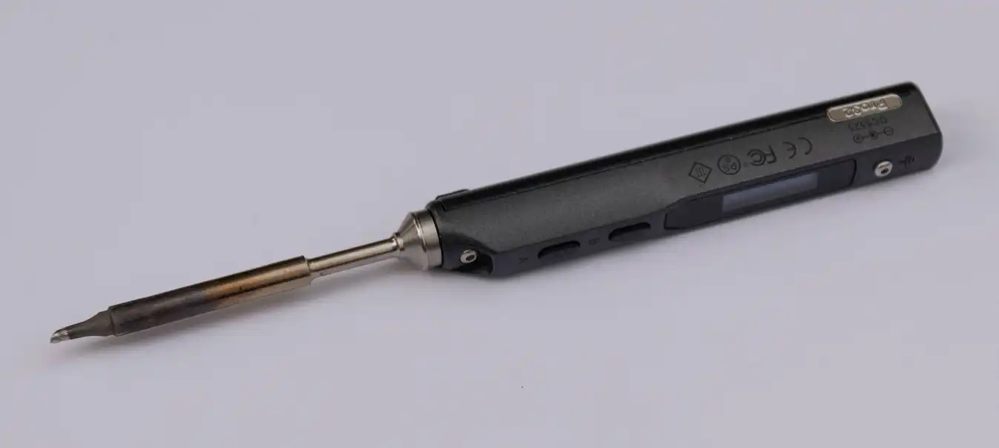
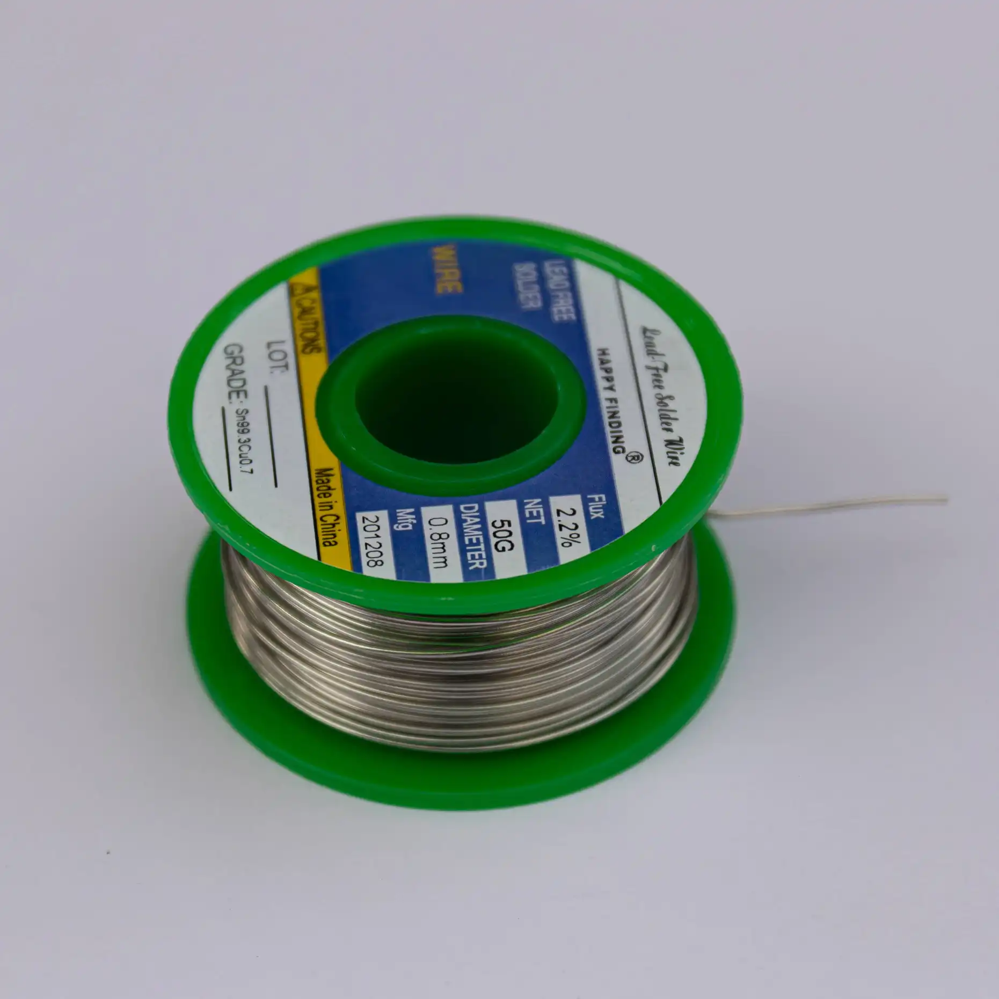

| Image                                  | Part                                     | Description                                                                                                           |
| -------------------------------------- | ---------------------------------------- | --------------------------------------------------------------------------------------------------------------------- |
|                                        |                                          |                                                                                                                       |
|                   | 2 x ProMicro compatible micro controller | You will need to supply your own promicro compatible micro controllers, for example the Helios.                       |
|  | soldering iron                           | We recommend a good soldering iron!                                                                                   |
|                  | solder                                   | Please use high quality solder (flux core or apply flux externally) to make your life easier when soldering this kit! |
