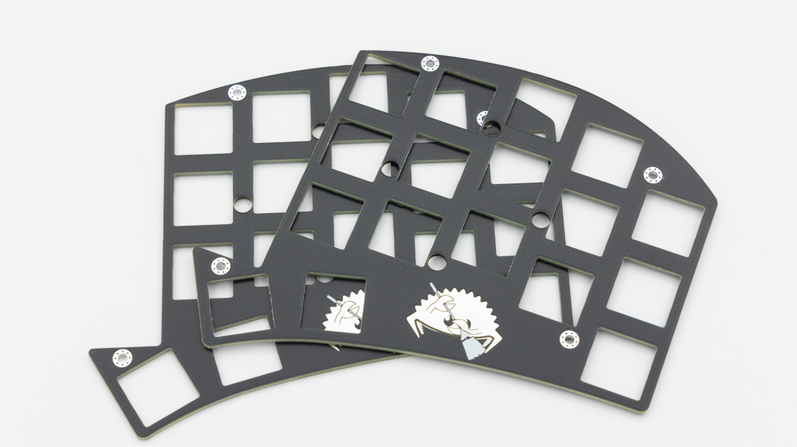
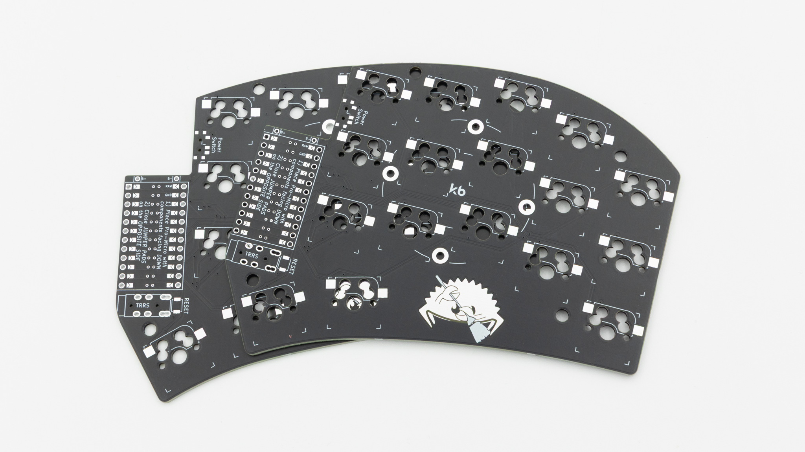
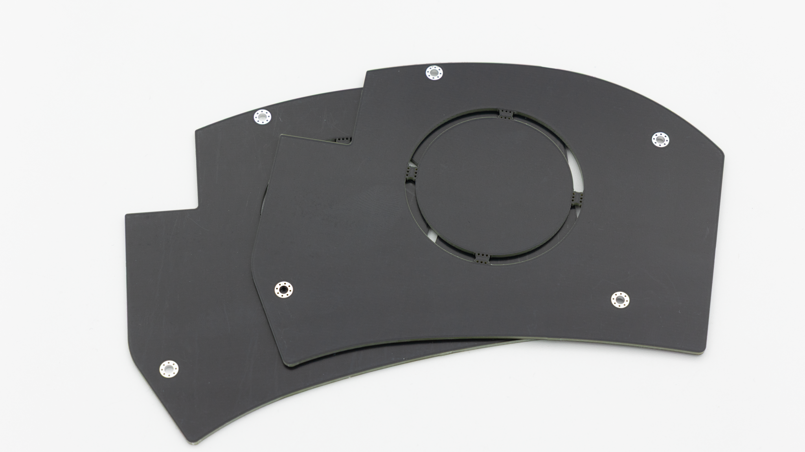
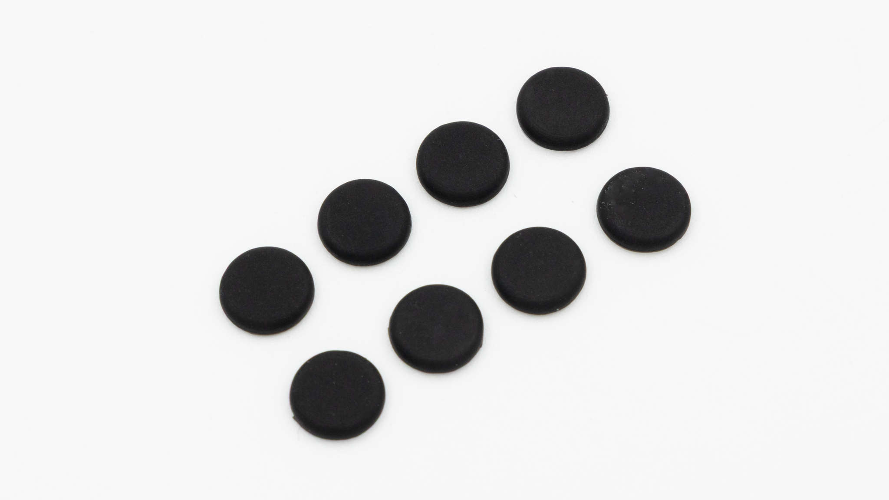
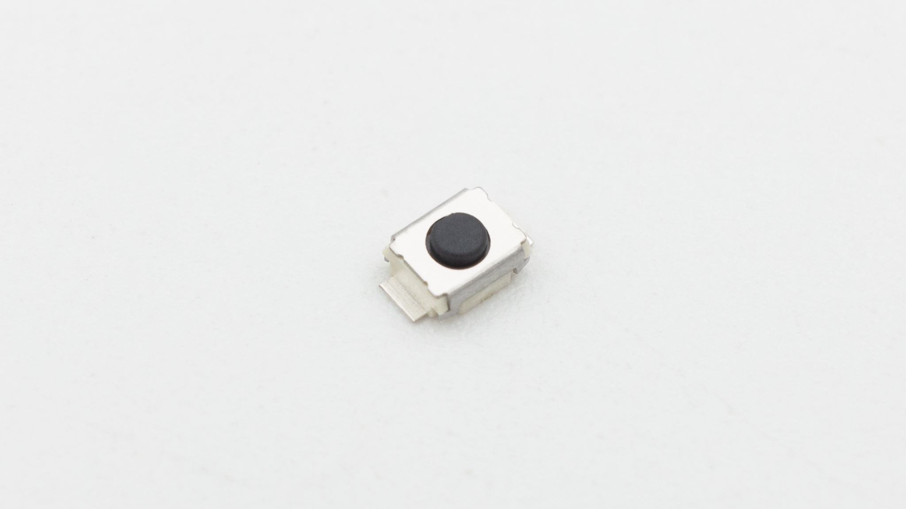
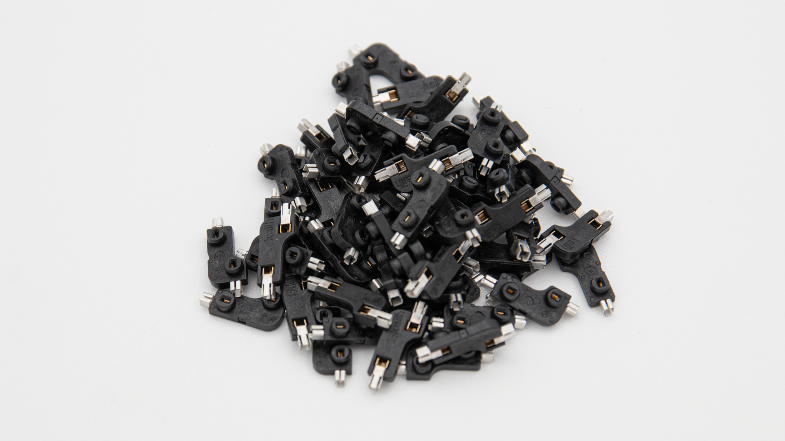
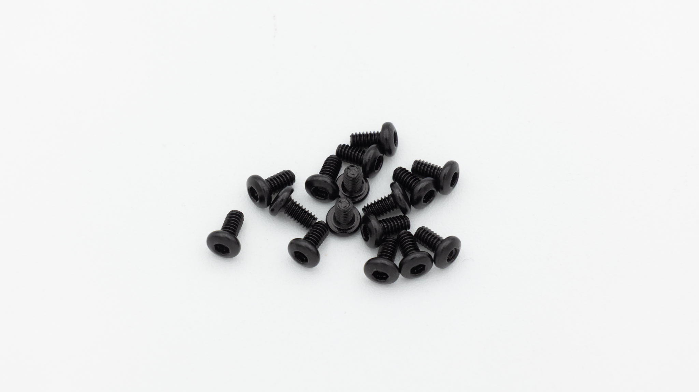
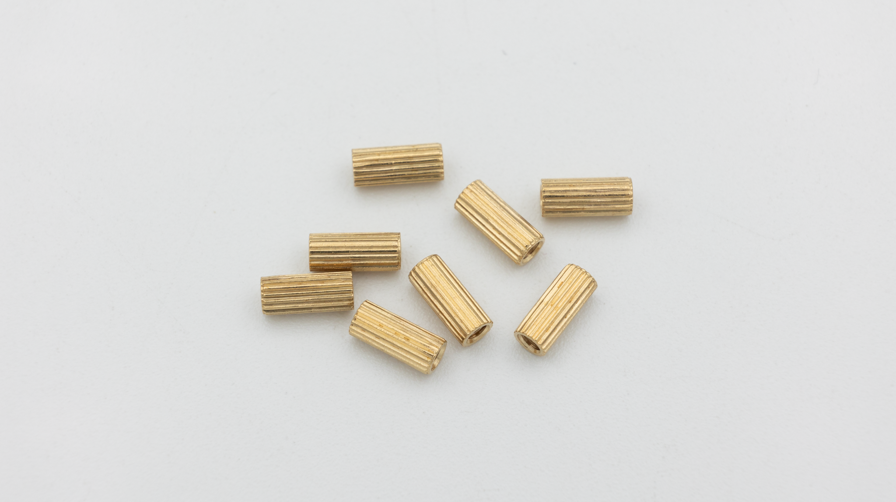
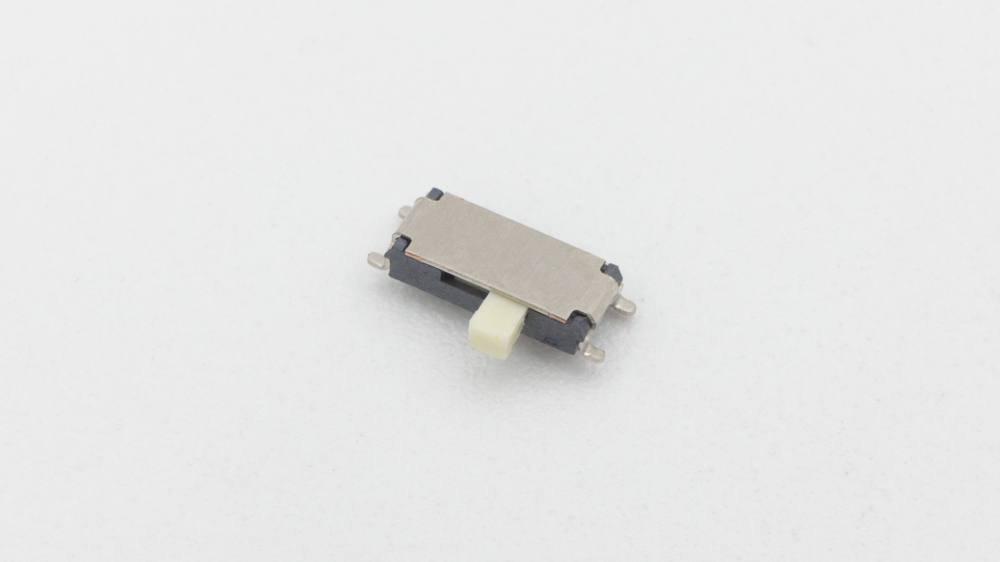

## General Parts

These parts are included in both versions of the kit.
| Image | Description | Quantity |
| ----------------------------- | --------------- | -------- |
| |
|  | Switch Plate | 2 |
|  | PCB | 2 |
|  | Bottom Plate | 2 |
|  | Rubber Feet | 8 |
|  | Reset Buttons | 2 |
|  | Hotswap Sockets | 35 |
|  | M2x4mm Screws | 16 |
|  | M2x8mm Standoffs | 8 |

## Version

Depending on the version, there will be different parts included in the kit.

### Wired Version

| Image                    | Description | Quantity |
| ------------------------ | ----------- | -------- |
|                          |
|    | TRRS jack   | 2        |
|  | TRRS cable  | 1        |

### Bluetooth Version

| Image                       | Description  | Quantity |
| --------------------------- | ------------ | -------- |
|                             |
|  | Slide Switch | 2        |


To make the wireless version of the Sweep work, you will need to buy yourself two 301225 lithium polymer batteries. If you don't have them already, try <a href='https://link.keeb.supply/lipo/301225'>these</a>.

