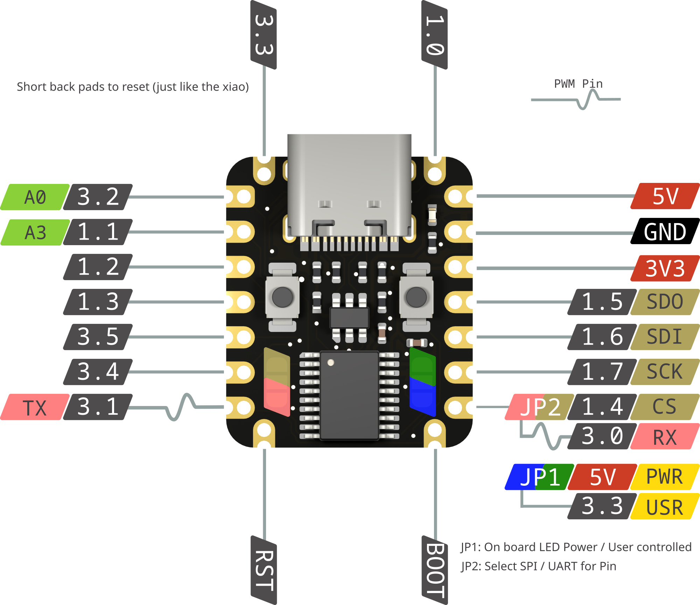

## General information

Miao is a [Xiao](https://www.seeedstudio.com/xiao-series-page) compatible microntroller developed by [kilipan](https://github.com/kilipan/miao). It uses a [ch552t](https://www.wch-ic.com/products/CH552.html) chip, which is very handy and cost efficient, including:

- Built-in 16KB Code Flash, 1KB XRAM and internal 256B iRAM
- Built-in USB controller and USB transceiver
- 2 full-duplex UARTs
- SPI
- 8-bit ADC
- Built in 24Mhz clock

For the ch552t you write firmware using [FAK](https://github.com/semickolon/fak) by semickolon.
FAK uses nickel to write configurations which makes things way simpler and less error prone compared to QMK.

## Xiao compatability

Miao is Pin compatible to the Xiao, there are even additional pins at the top. Underneath you can find 2 pads to reset - just like the xiao.

## Flashing

For flashing you use wchisp and to build the firmware (and also flash) you can follow the getting started [guide for FAK](https://github.com/semickolon/fak?tab=readme-ov-file#getting-started).

## ESD protection

To avoid acidentially shocking your Miao while plugging it in theres an onboard ESD protection to ensure longevity!

## Split capability

FAK handles the halves independently which makes configuring them [very easy](https://github.com/semickolon/fak?tab=readme-ov-file#split-support).

## Jumpers

There are two solder jumpers onboard.
They configure the bus output and the LED function - please consult the Pinout for help.

### Bus

You can choose between UART and SPI mode for the bottom right pin.

### LED

You can choose between a power LED and a user LED.
The user LED is adressed by pin 3.3.

## Pinout

