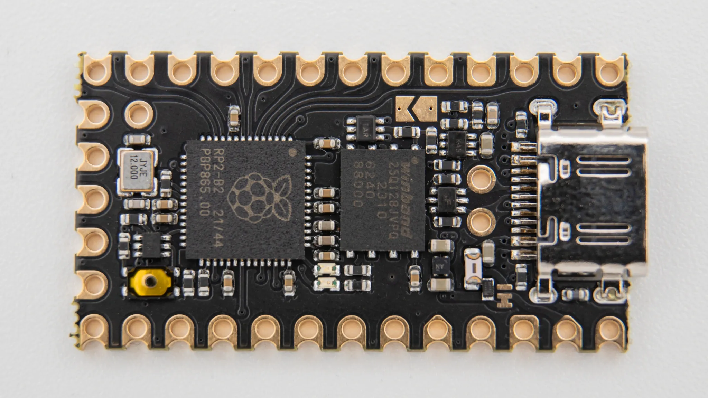

## Soldering

If you do not have experience with soldering, please refer to this [Quick Start guide]().



### Reset Buttons

Solder on the reset buttons to the top of the PCB..

### TRRS Jacks

You will need to solder in the TRRS jacks on the same side as the reset button.

### Jumper

To make the reversible PCB work you need to connect jumpers on both halfes. Connect all of the marked jumpers around the controller on the same side as the TRRS jack and reset button are located.

### Hotswap Sockets


Solder on the hotswap sockets to the back of the PCB. You can find instructions for that [here]().

### Diodes

Solder on the diodes on the same side as the hotswap sockets. Read through [here]() if you have not done that before.

### Controller Standoffs


Next solder on the standoffs for your controller. They go on the same side as the TRRS jack and reset button. Read through [here]() if you have not done that before.

### Controller

Before soldering the controllers onto the PCB we should get your controller flashed.

You can find the firmware <a href="https://files.keeb.supply/firmware/nomad/" >here<a>. And instructions on how to flash a controller [here](). 

Plug in your controller now and see if it pops up in [VIAL]().

If it does you have successfully flashed your controller.

If your controller is working, you can solder it in. Instructions on how to do that can be found [here](). When you have the PCB in front of you, the USB port should go to the top of the PCB. You should not see the components of the controller, when it is sitting on the PCB.

When you have your controller soldered in, it is good practice to do a [matrix test](). Since the Sweep is a split keyboard, you need to plug in the two halves together using the TRRS cable.


## Final Assembly

Start by putting on the rubber feet. We provide 4 feet per side which you can place wherever you want.

After that put the PCB inside the case.

Insert the switches through the case into the PCB.

Screw the standoffs into the PCB.

Remove the protective film from the acryl, lay it ontop of the stanoffs and put screws into them.

Put on keycaps.

And your Sweep keyboard is done!

