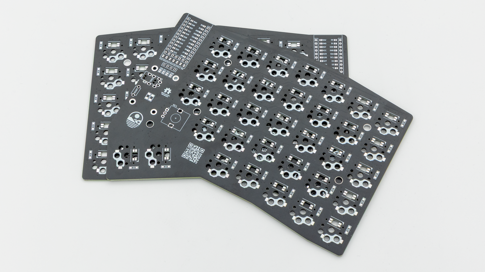

## General Parts

These Parts are included in both versions of the kit.
| Image | Description | Quantity |
| ----------------------------- | --------------- | -------- |
| |
|  | reversible PCB | 2 |
|  | 3D Printed Case | 2 |
|  | Acrylic Cover | 2 |
|  | M2x12mm Standoffs | 8 |
|  | M2x5mm Flathead Screws | 16 |
|  | Rubber Feet | 8 |
|  | TRRS Cable | 1 |
|  | Reset Buttons | 2 |
|  | TRRS jack | 2 |
|  | Hotswap Sockets | 70 |
|  | Diodes | 70 |
