The Re-gret kit on KeebSupply is available in a wireless and wired version. Depending on the version there will be different components included.

# Included in both Versions

| Image                                 | Description                                        | Quantity |
| ------------------------------------- | -------------------------------------------------- | -------- |
|                                       |
| 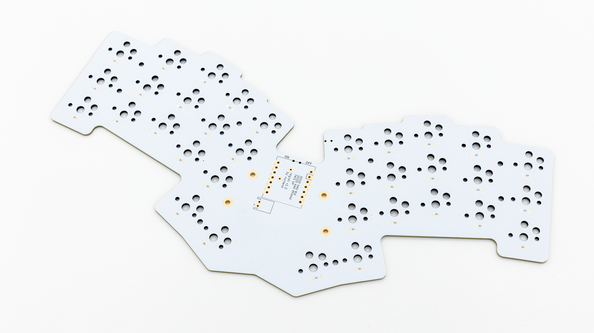                       | PCB                                                | 1        |
| 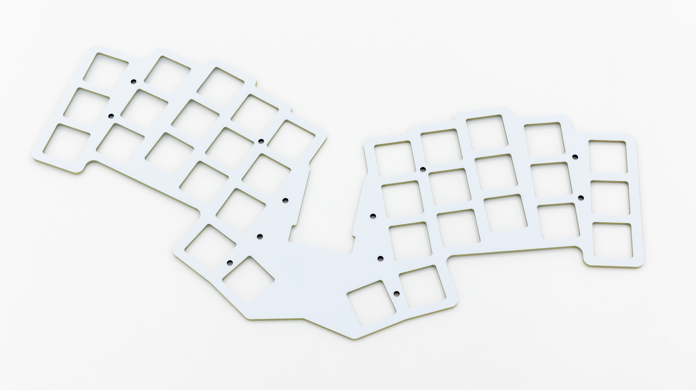                   | Plate                                              | 1        |
| 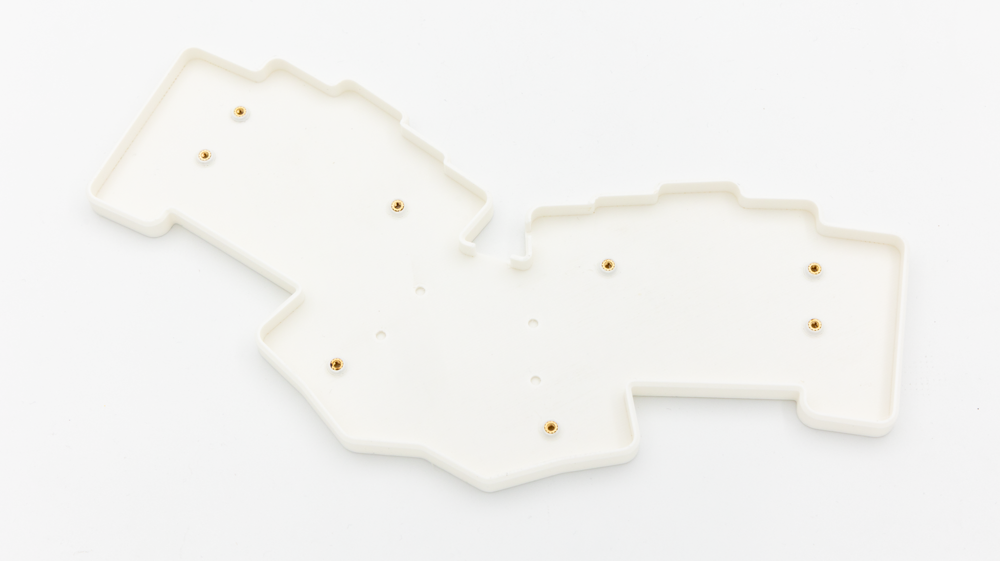                     | 3D printed case with heat set inserts preinstalled | 1        |
| 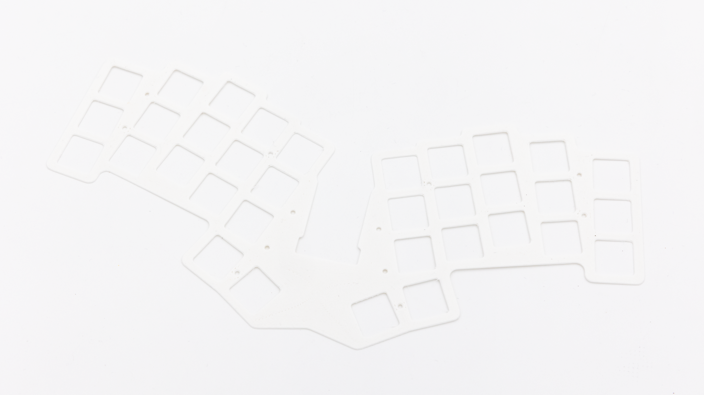     | 3D printed middle layer                            | 1        |
| 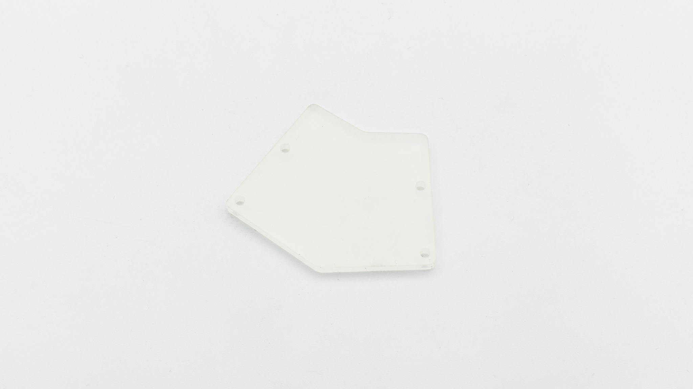             | Acrylic cover                                      | 1        |
| 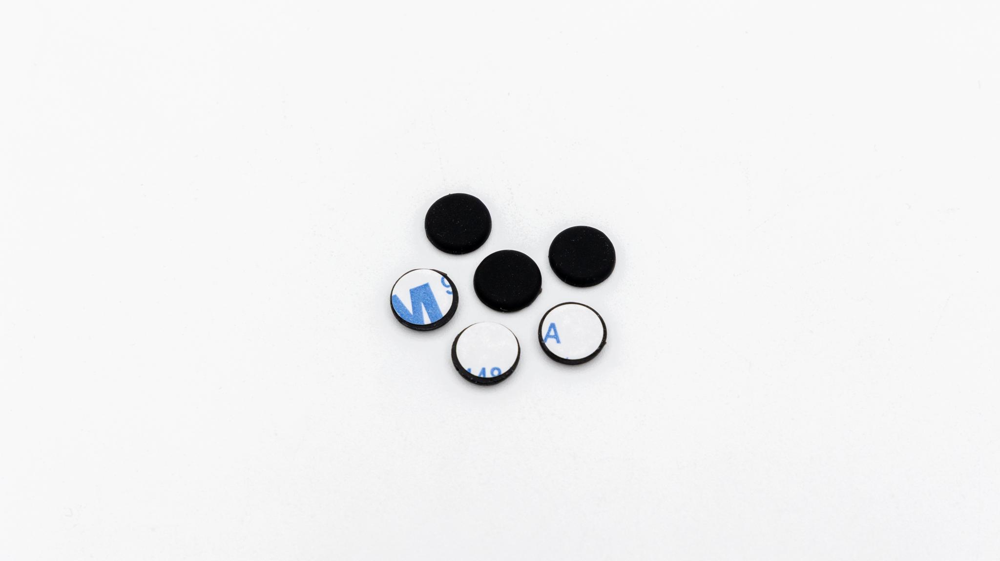              | Rubber feet                                        | 6        |
| 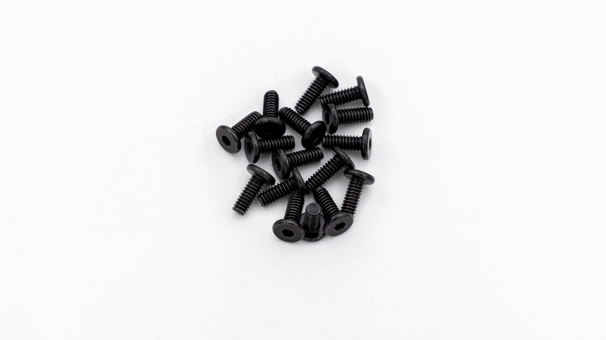                 | M2x5mm flat head screws                            | 16       |
| 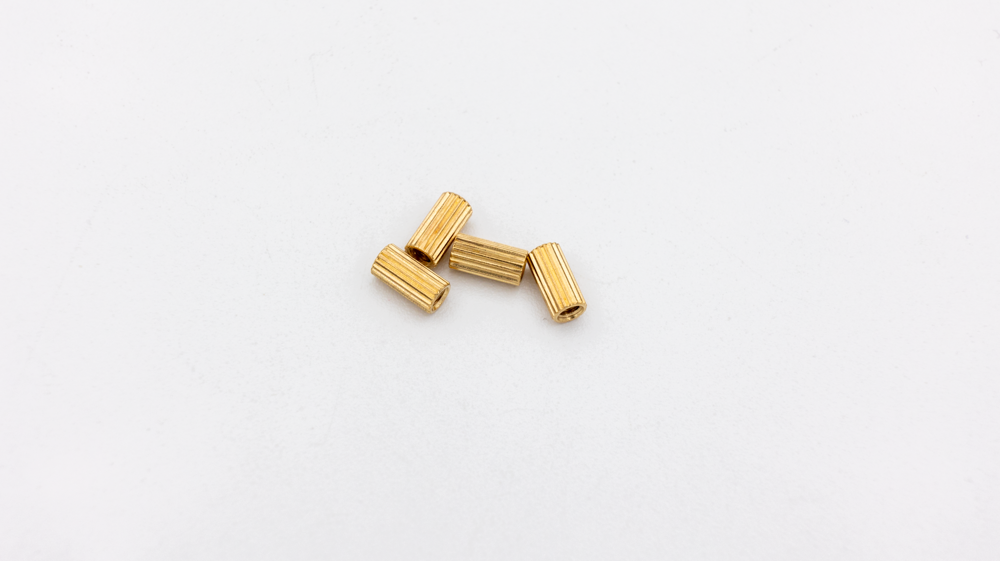           | M2x8mm standoffs                                   | 4        |
| 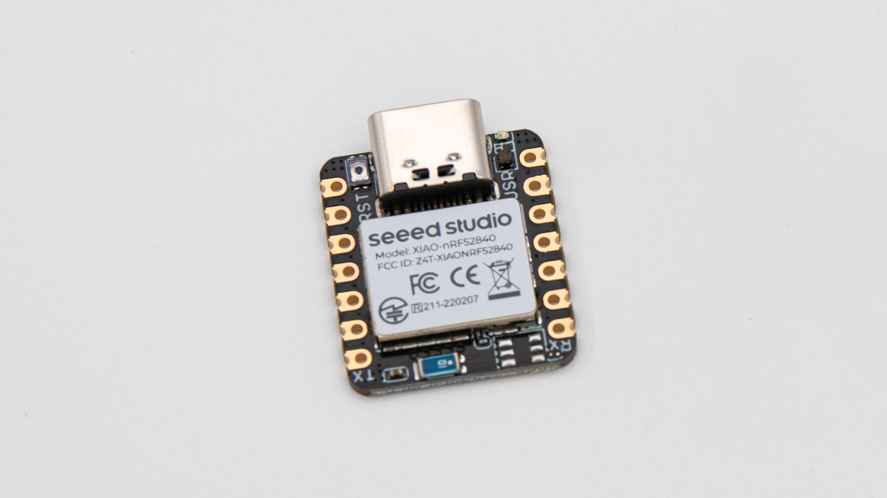        | Seeed controller (RP2040 or nRF52840)              | 1        |
| 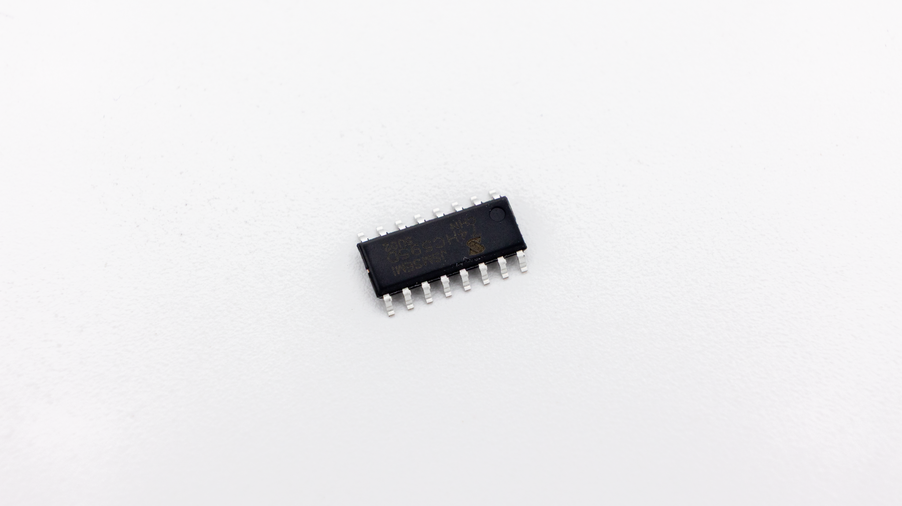 | Shift register                                     | 1        |
| 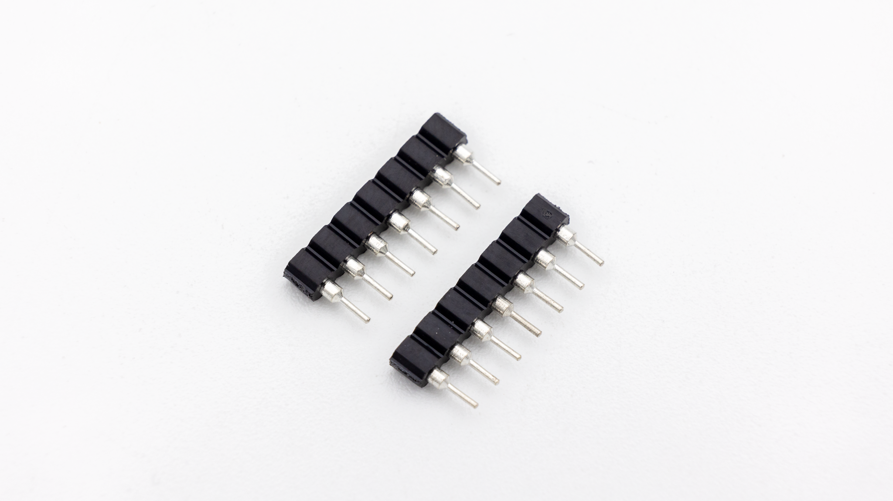         | IC sockets                                         | 2        |
| 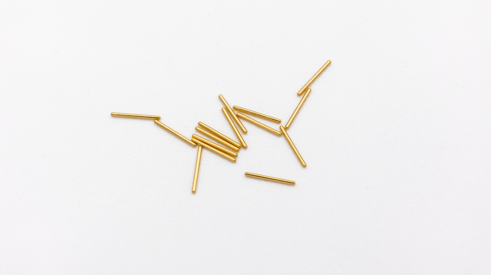           | MillMax pins                                       | 14       |
| 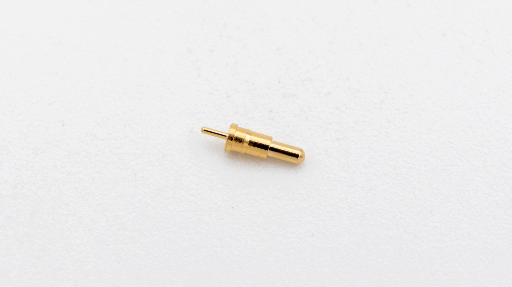                 | PogoPin                                            | 1        |
| 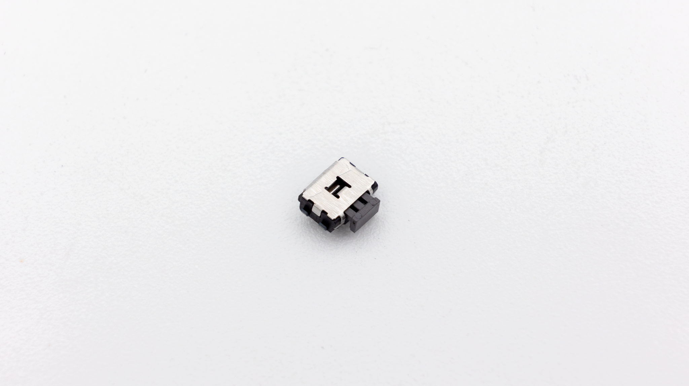            | Reset button                                       | 1        |
| 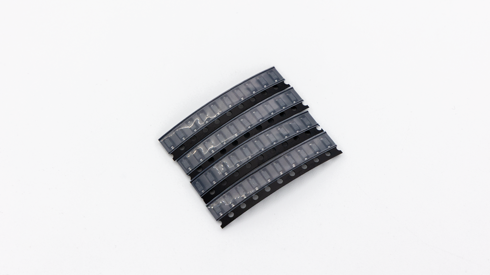                 | Diodes                                             | 40       |
|          | Choc HotSwap sockets                               | 35       |

# Only included in the wireless Version

| Image                                       | Description           | Quantity |
| ------------------------------------------- | --------------------- | -------- |
|                                             |
| 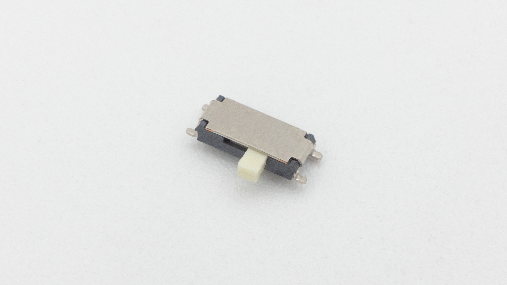                  | Slide switch          | 1        |
| 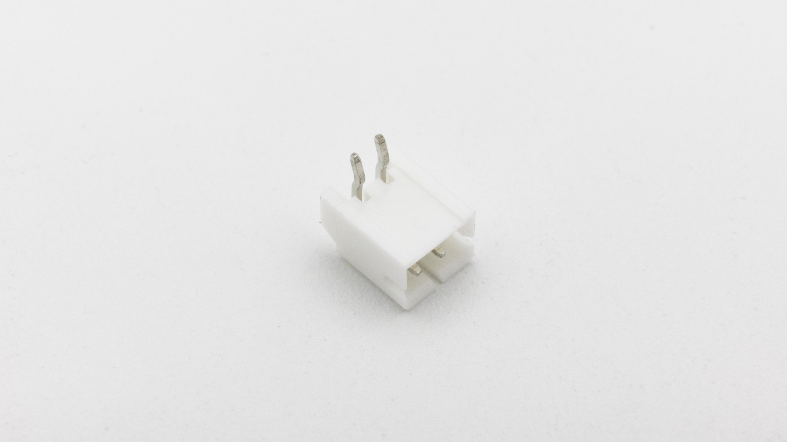 | JST battery connector | 1        |
|                        | one extra PogoPin     | 1        |


 If you don't have one already, try [this one](https://www.ebay.de/itm/255510046348?var=555462939782).
