| Image                                      | Description                | Quantity |
| ------------------------------------------ | -------------------------- | -------- |
|                                            |
| 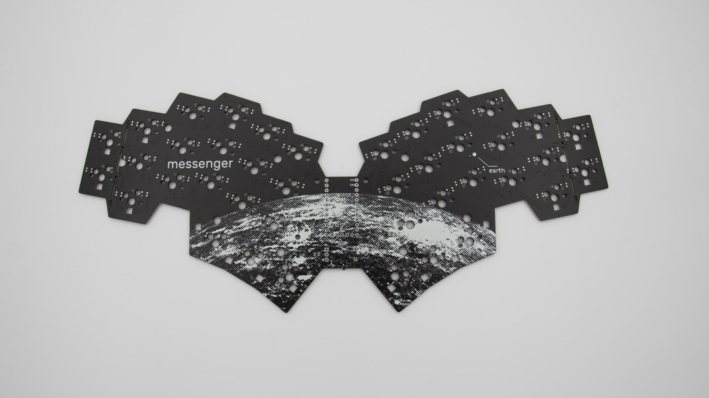                            | PCB                        | 1        |
| 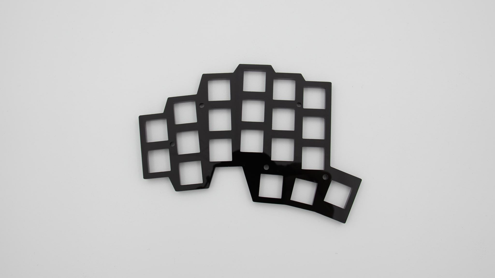   | acrylic switch plate left  | 1        |
| 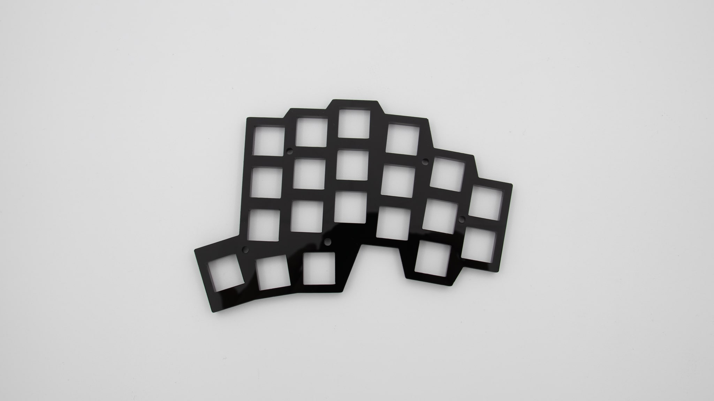 | acrylic switch plate right | 1        |
| 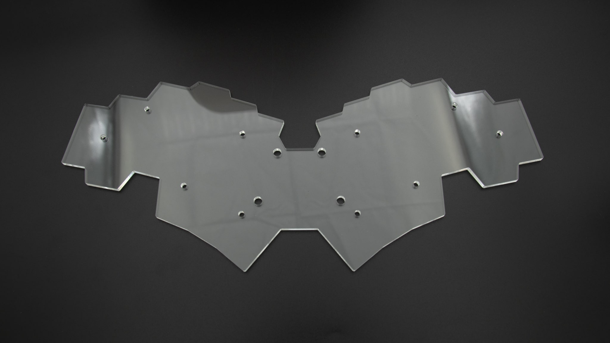                 | acrylic bottom plate       | 1        |
| 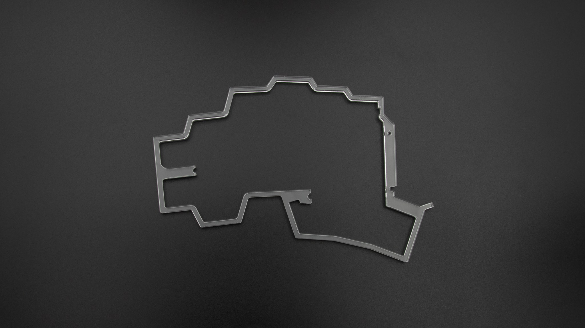        | acrylic middle layer left  | 1        |
| 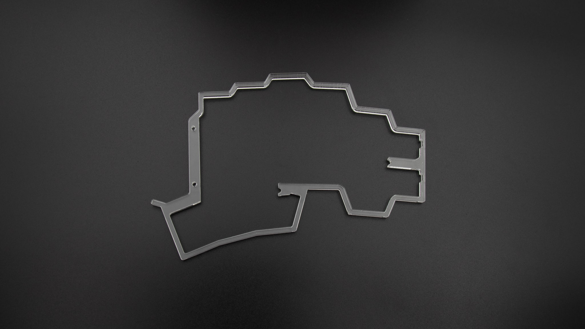      | acrylic middle layer right | 1        |
| 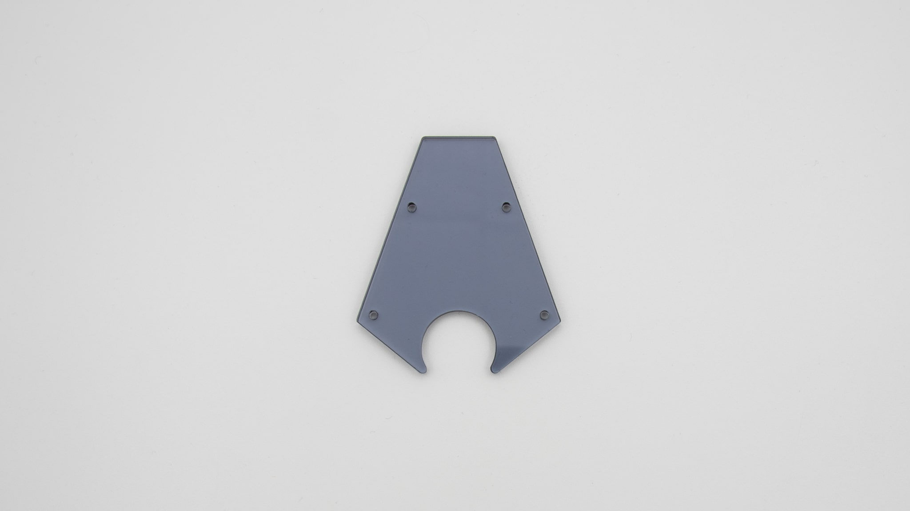                        | acrylic cover              | 1        |
| 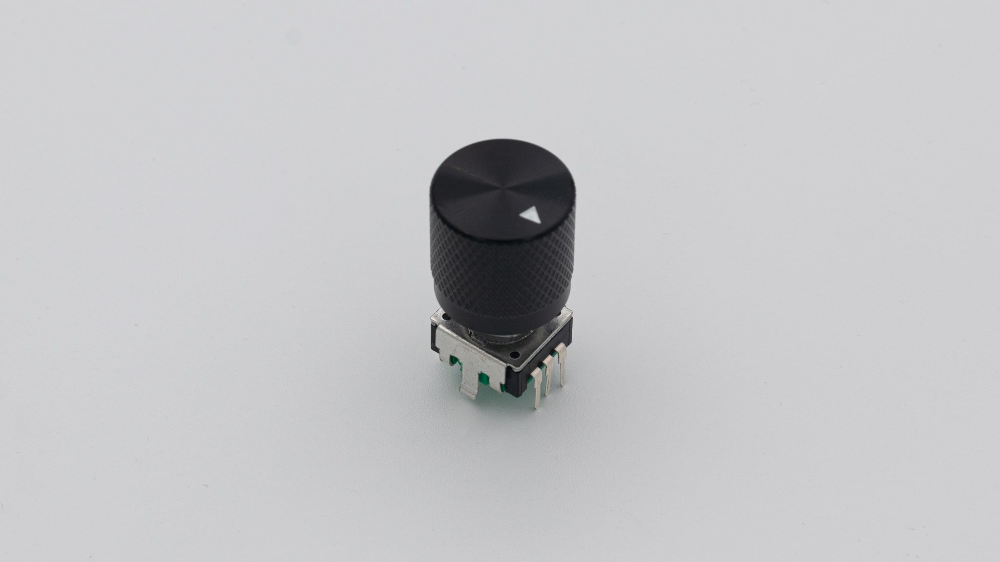                    | rotary encoder with knob   | 1        |
|                                | hotswap sockets            | 40       |
|                                | SK6812mini-e LEDs          | 18       |
|                                 | JST-PH battery connector   | 1        |
|                             | rubber feet                | 4        |
| 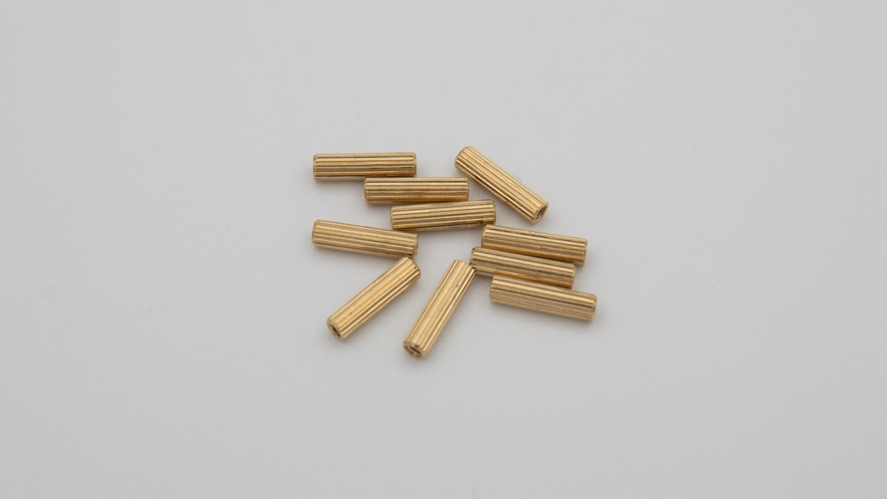       | standoffs (M2x12mm)        | 10       |
| 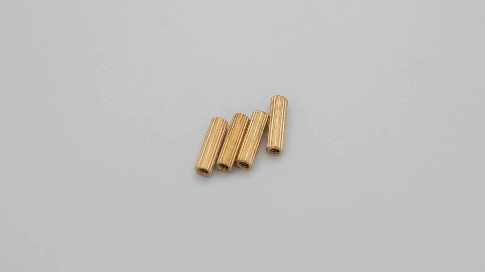      | standoffs (M2x11mm)        | 4        |
| 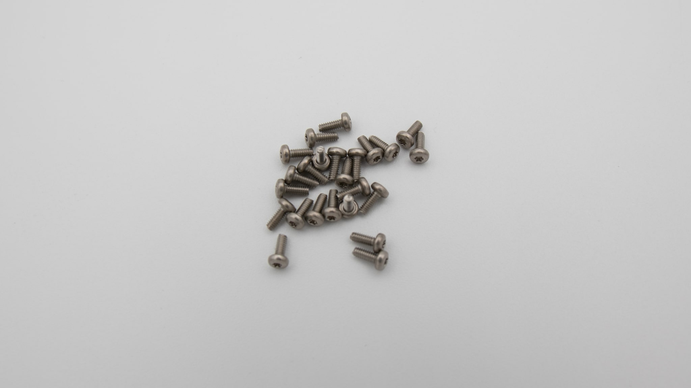             | torx screws (M2x5mm)       | 24       |
| 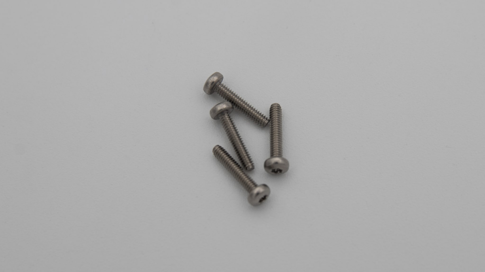             | torx screws (M2x11mm)      | 4        |
| 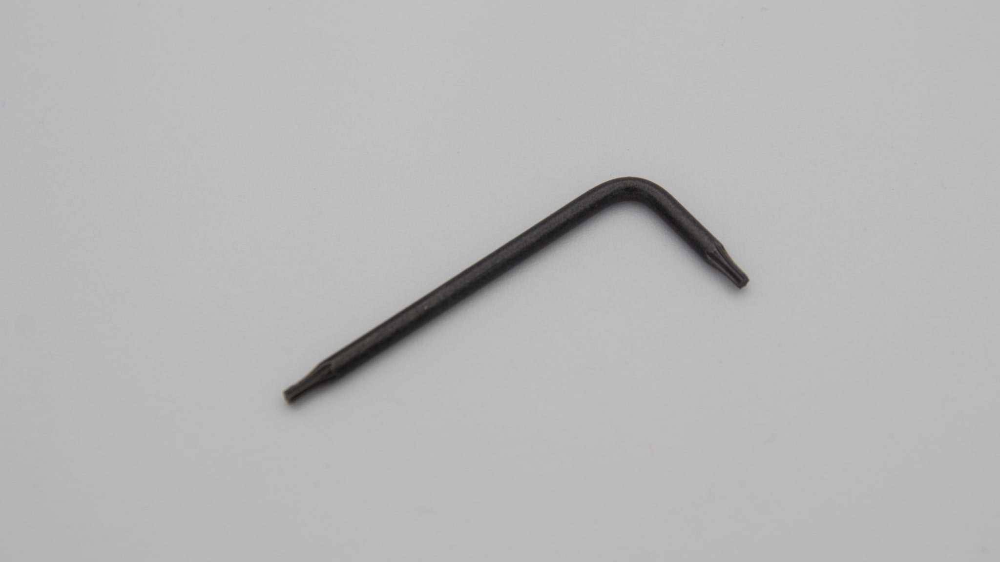                | Torx T6 allen key          | 1        |