## PCB

Let's start the assembly with the PCB. It does not matter if you have the barebones or case variant here.
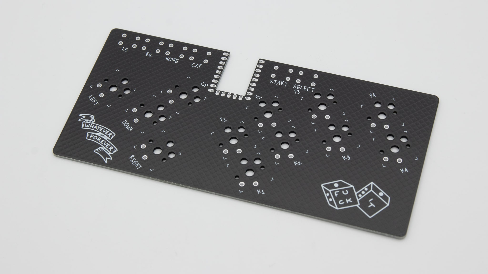

 You can start by soldering on your hotswap sockets. You can find Instructions on how to solder hotswap sockets [here]().
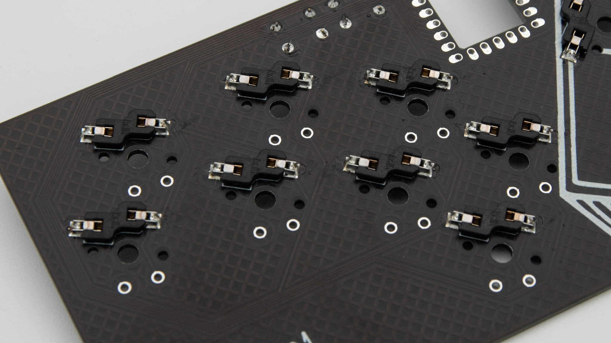

 Now solder on the 6 through hole buttons. They have an orientation, so you can't put them in the wrong way. Now just add a little bit of solder onto the back side.
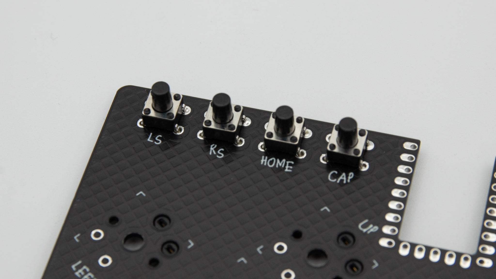


 After that you can solder on your Controller. You can lay the RP2040 Zero directly onto the PCB and solder it on there. You can find Instructions on how to solder a controller directly onto the PCB [here]().
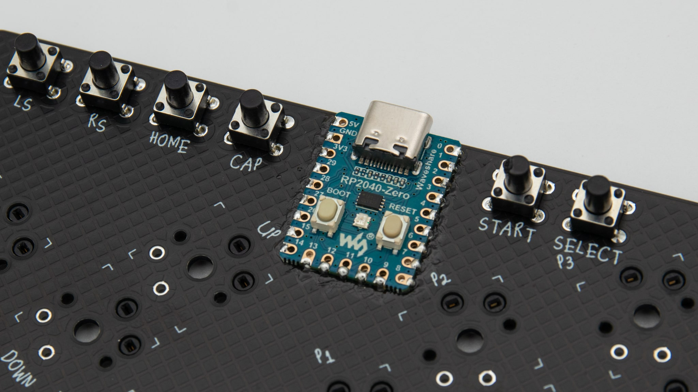

 You should test your PCB now if it is fully working. The controllers come preflashed with a version of GP2040, a firmware for fightpads. Please read through the docs [here](https://gp2040-ce.info/#/) to make yourself familiar with the software.

A good tester can be found [here](https://gamepad-tester.com/).

 Skip to the next section depening on the kit you have:
 [barebones version]()
 [case version]()

## barebones assembly

If you have the barebones kit, assembly is almost finished now. As a next step you can put in your switches.
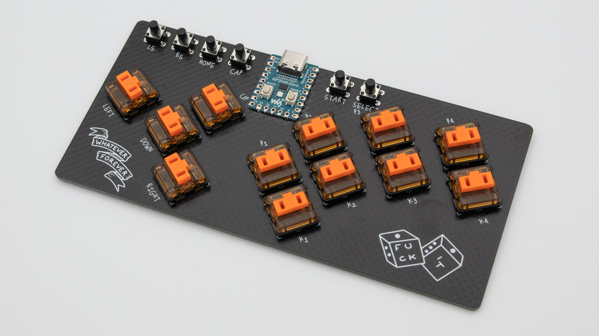

 After that put on your keycaps.
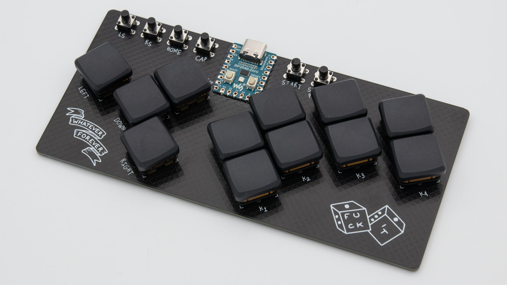

 Now you just have to put on your Rubber feet and your are done!
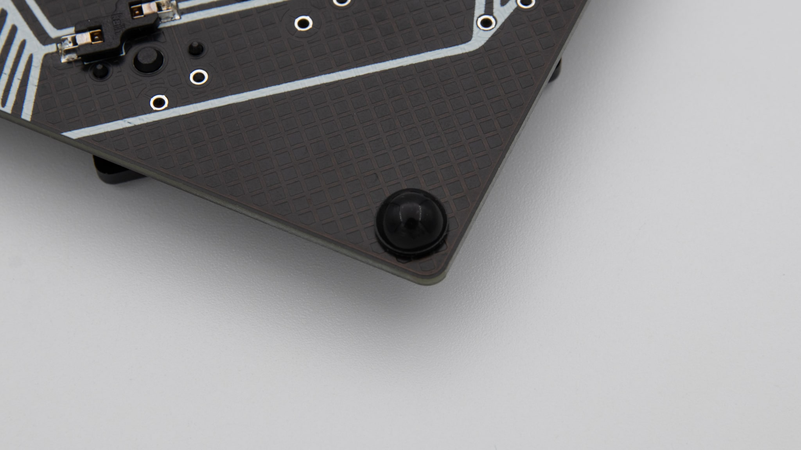

## case assembly

 You can start by pushing on the small rubber keycaps for the tht buttons at the top.
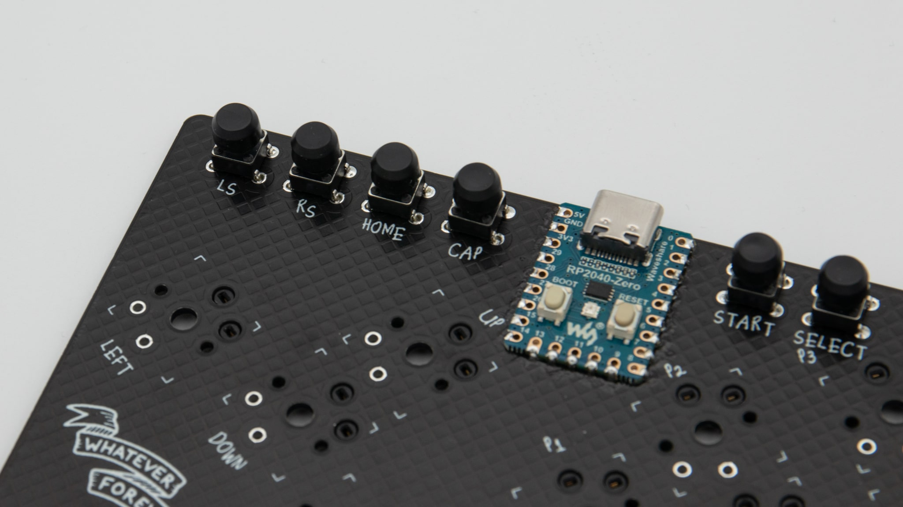

 In the case version you will have to put the switch plate between the switches and PCB. So take your top half of the case, and push in the switches through the switch plate into the PCB.
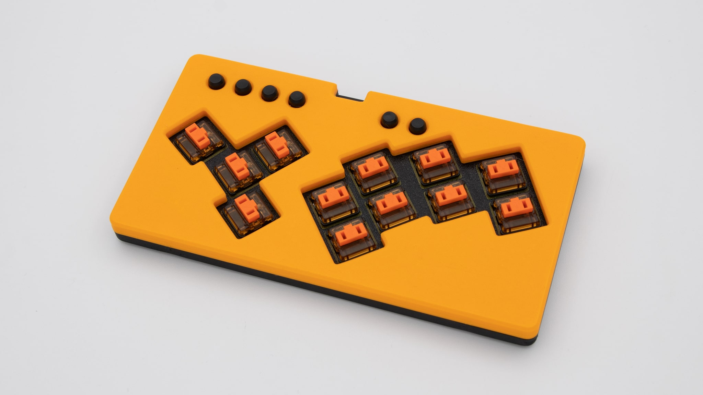

 Now that your top half of the case is ready, you can just snap it onto the bottom half. Since the magnets come preinstalled, you don't have to do anything here.
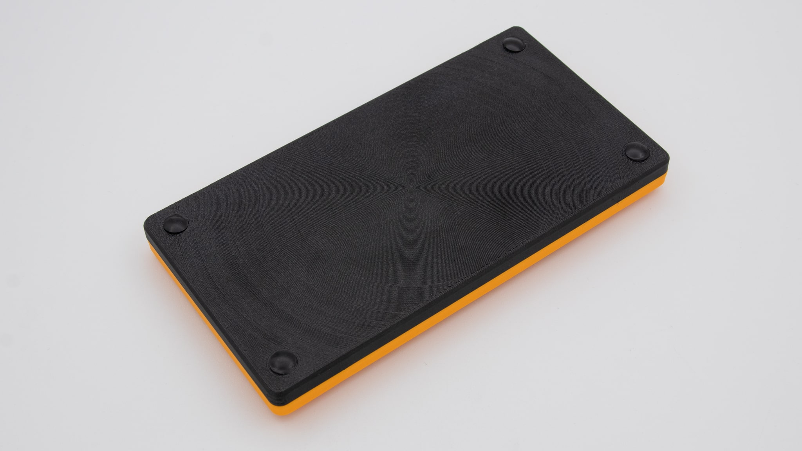

 And your Stress is finished!
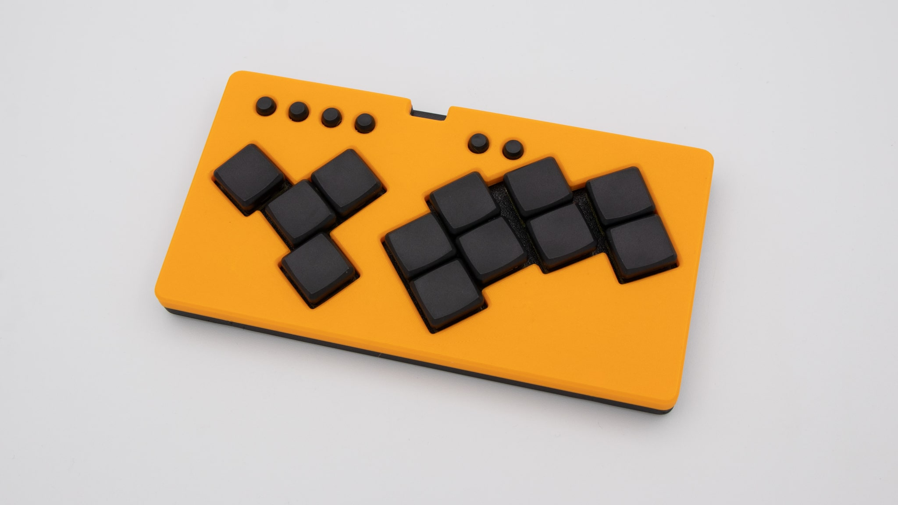