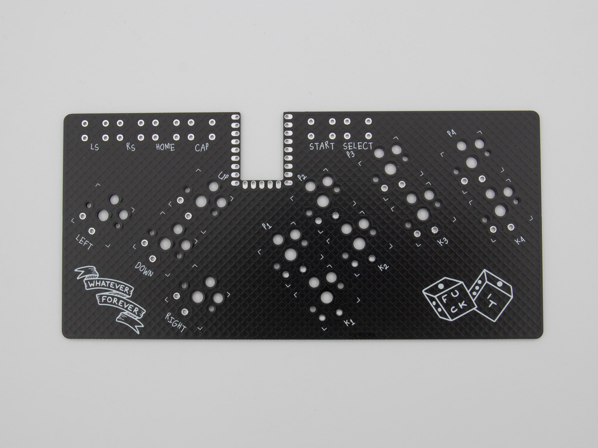
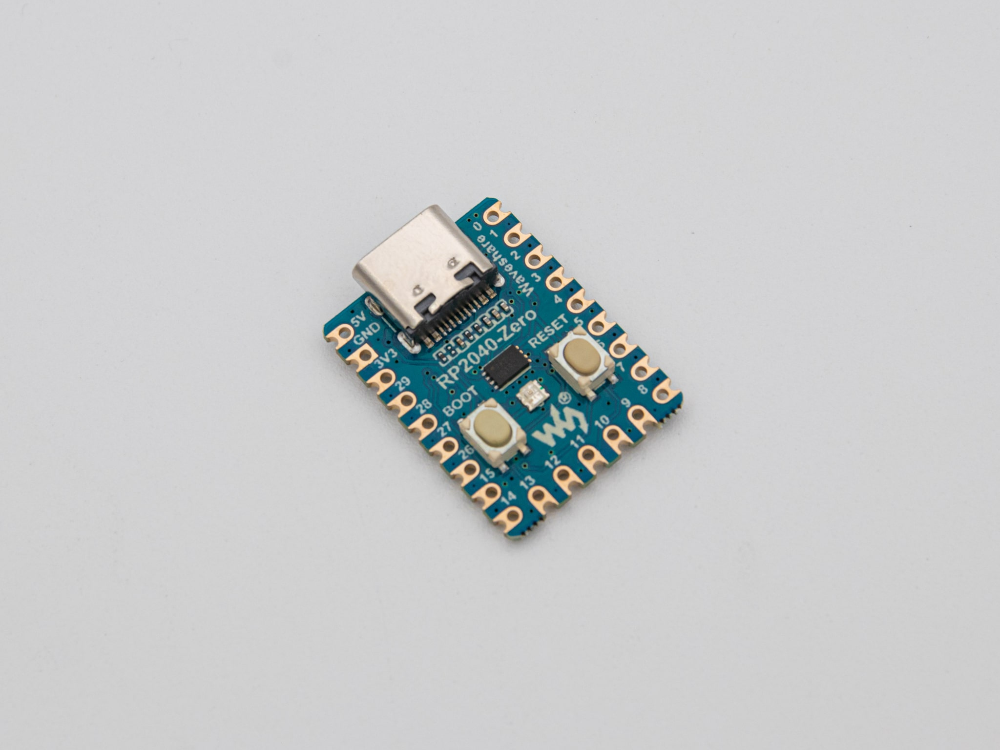
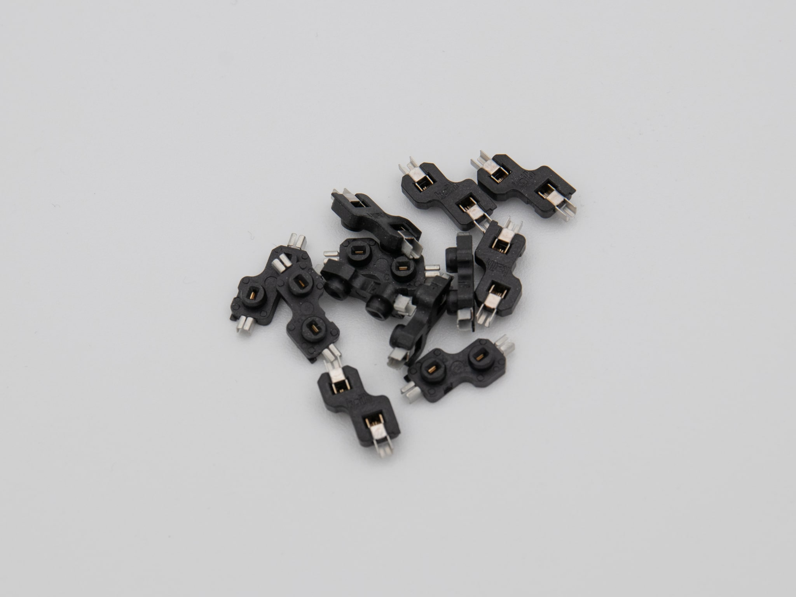
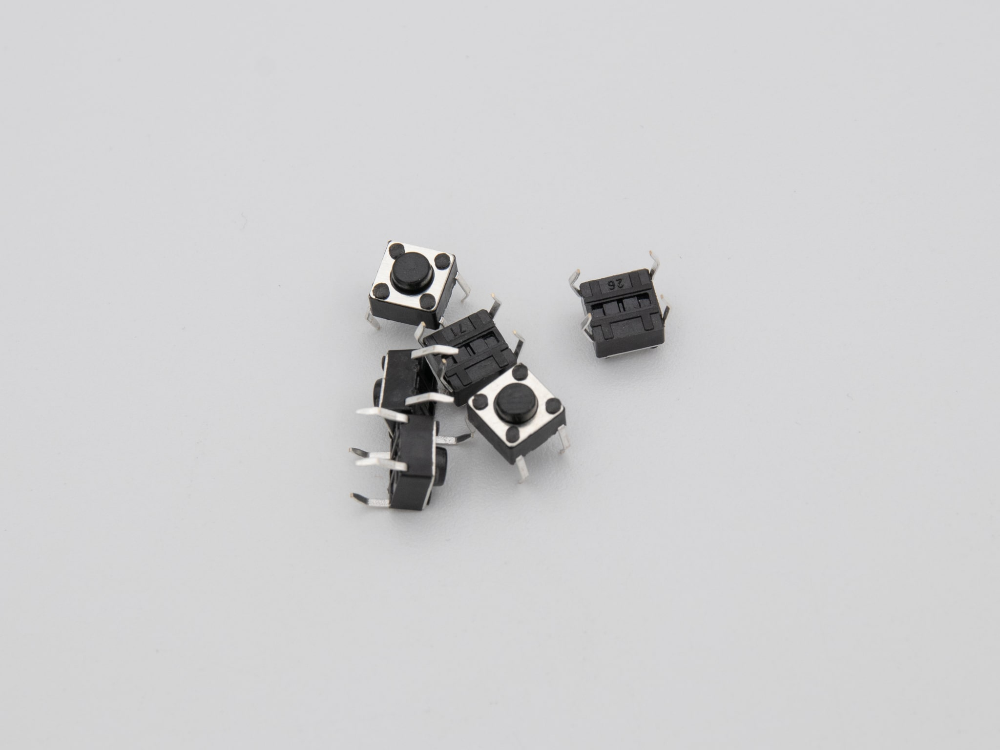
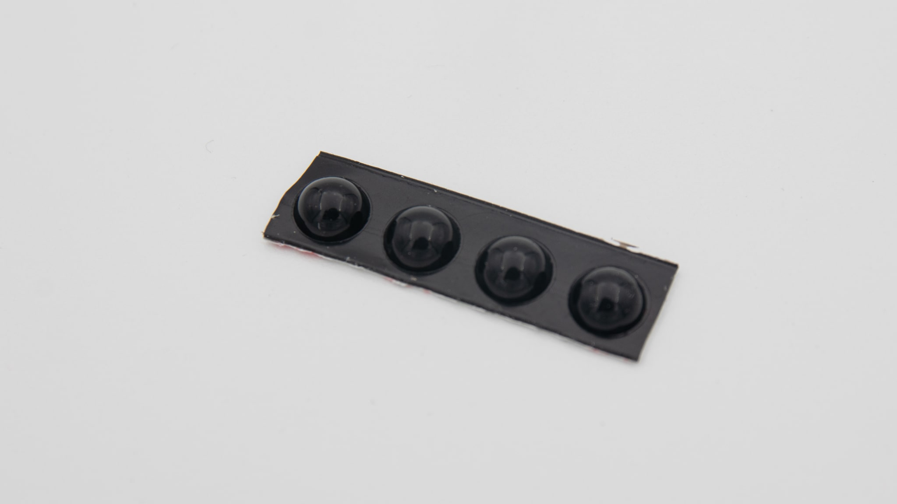
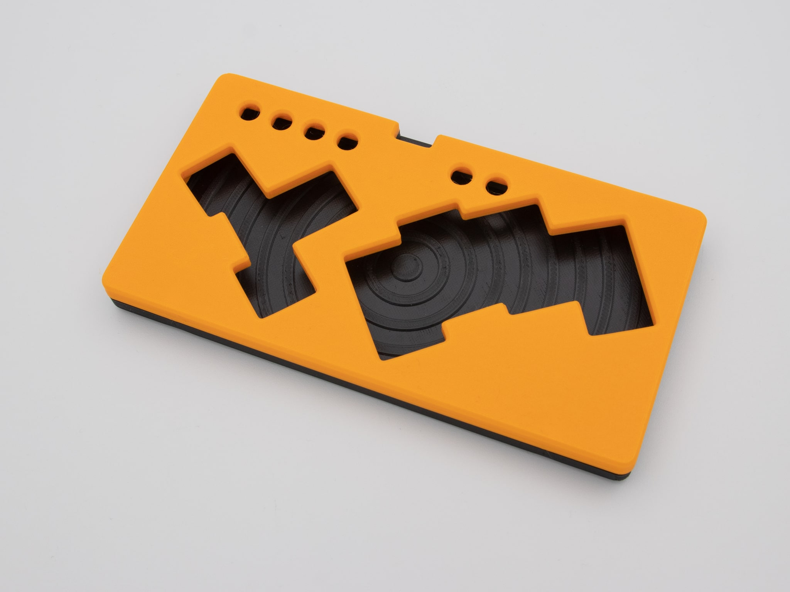
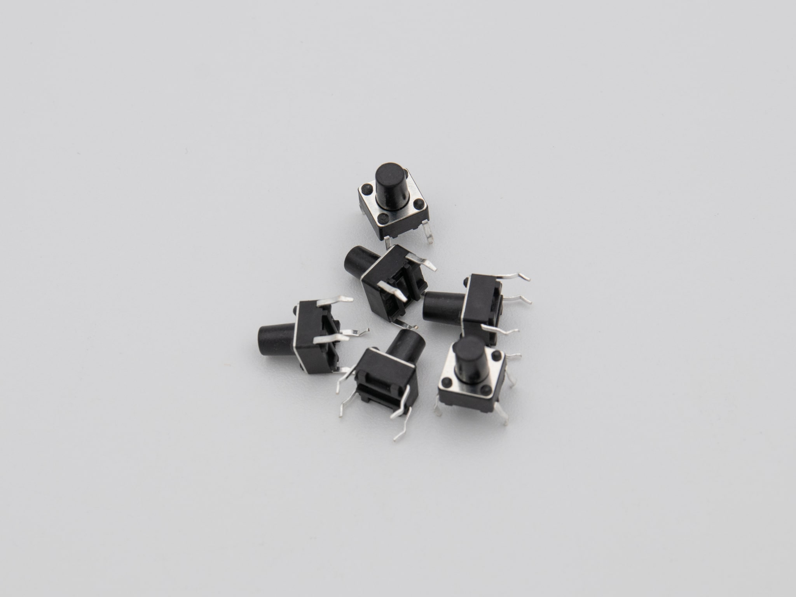
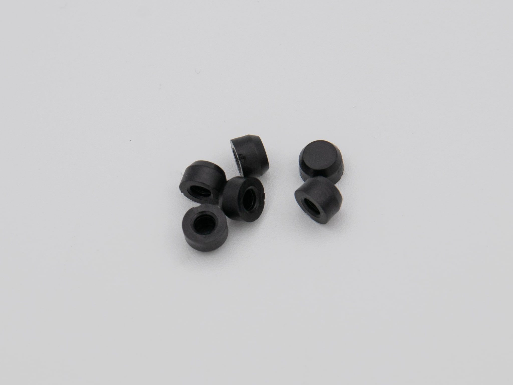

 Depending on the version you chose to buy, different components will be included.

## barebones version
| Image                           | Description                                                | Quantity |
| ------------------------------- | ---------------------------------------------------------- | -------- |
|                                 |
|                  | PCB                                                        | 1        |
|            | RP2040 Zero                                                | 1        |
|      | Kailh HotSwap sockets                                      | 12       |
|  | THT buttons (Different to the ones in the case version!!!) | 6        |
|    | Rubber Feet                                                | 4        |

## case version
The case assembly includes the 3D printed parts, magnets, heat inserts, and screws required for the case. Heat inserts have already been inserted into the 3D printed parts, and the magnets are securely held in place with superglue. There is no need for you to assemble the case yourself.
| Image                         | Description                                                     | Quantity |
| ----------------------------- | --------------------------------------------------------------- | -------- |
|                               |
|              | 3D printed case assembly                                        | 1        |
|                | PCB                                                             | 1        |
|          | RP2040 Zero                                                     | 1        |
|    | Kailh HotSwap sockets                                           | 12       |
|  | THT buttons (Different to the ones in the barebones version!!!) | 6        |
|  | rubber caps                                                     | 6        |