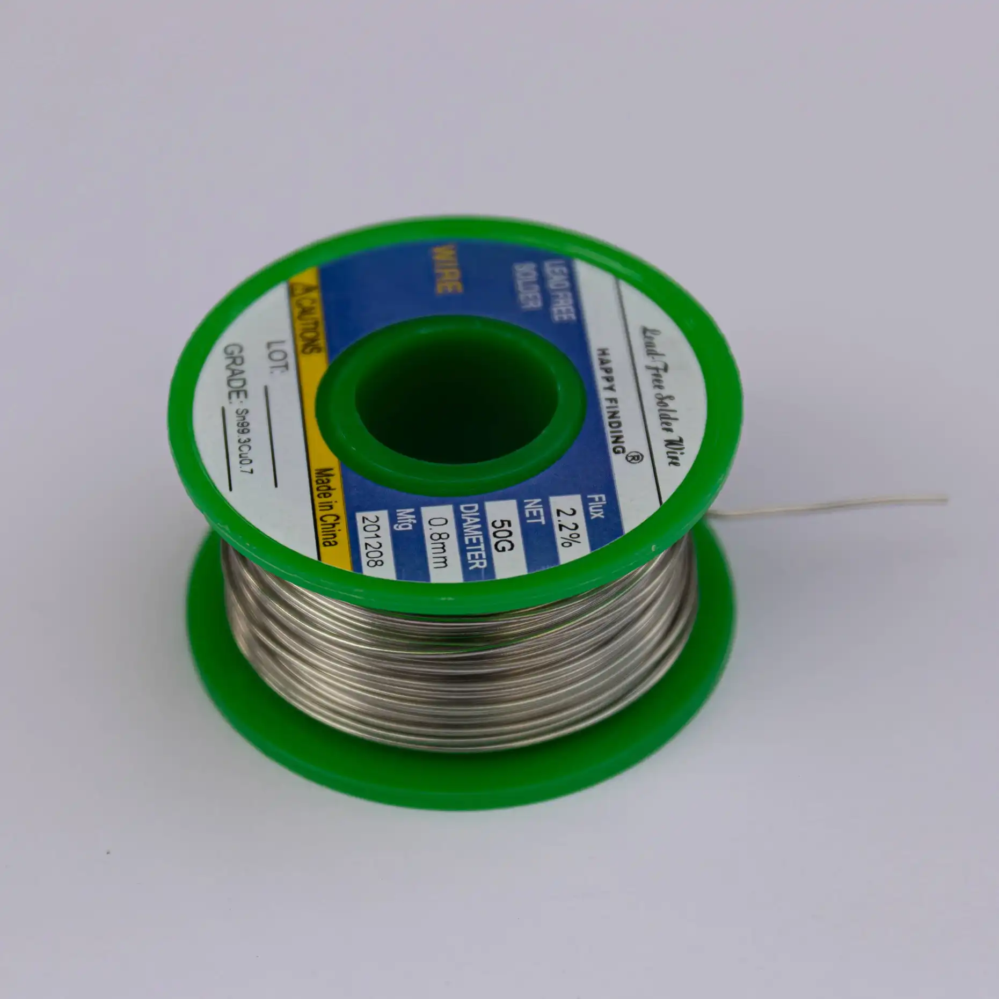

| Image                                  | Part                                 | Description                                                                                                           |
| -------------------------------------- | ------------------------------------ | --------------------------------------------------------------------------------------------------------------------- |
|                                        |                                      |                                                                                                                       |
|                   | Waveshare Zero compatible Controller | We recommend the 0xCB Gemini!                                                                                         |
|  | soldering iron                       | We recommend a good soldering iron!                                                                                   |
|                  | solder                               | Please use high quality solder (flux core or apply flux externally) to make your life easier when soldering this kit! |
