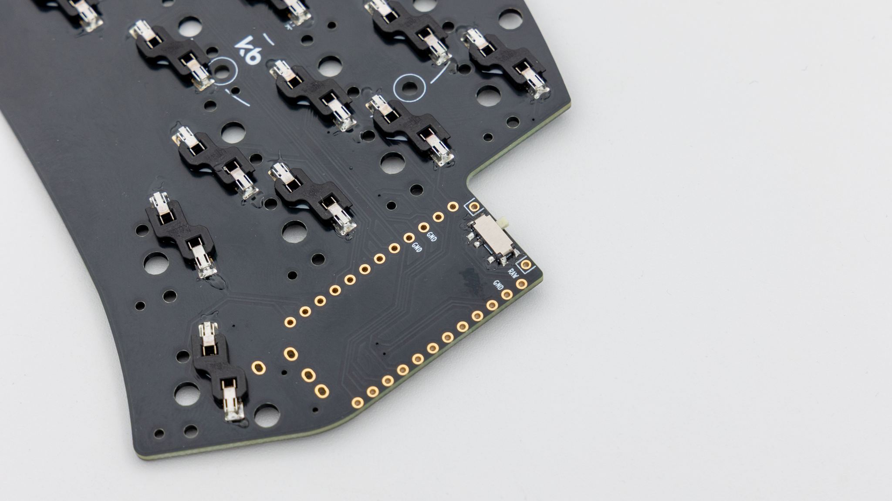
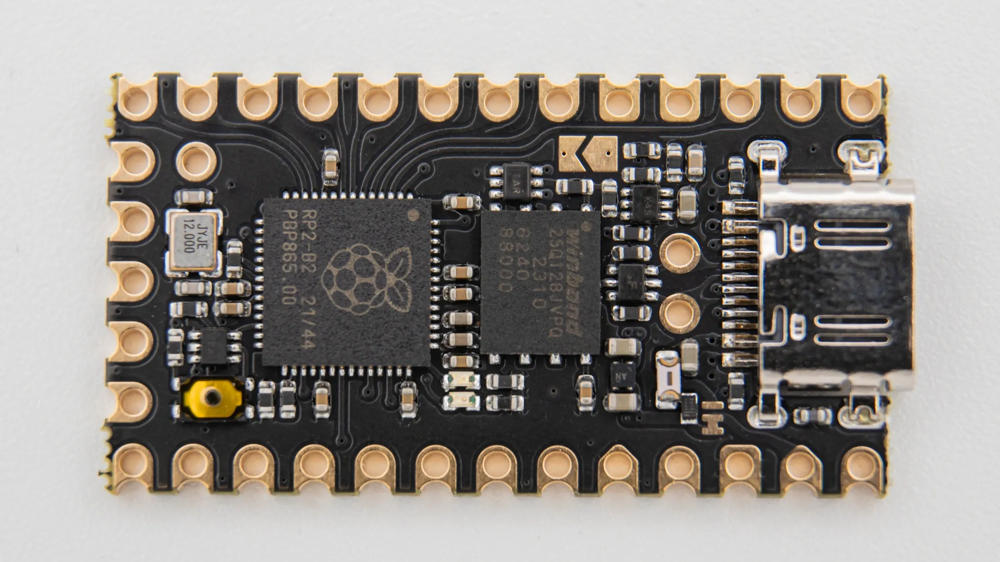
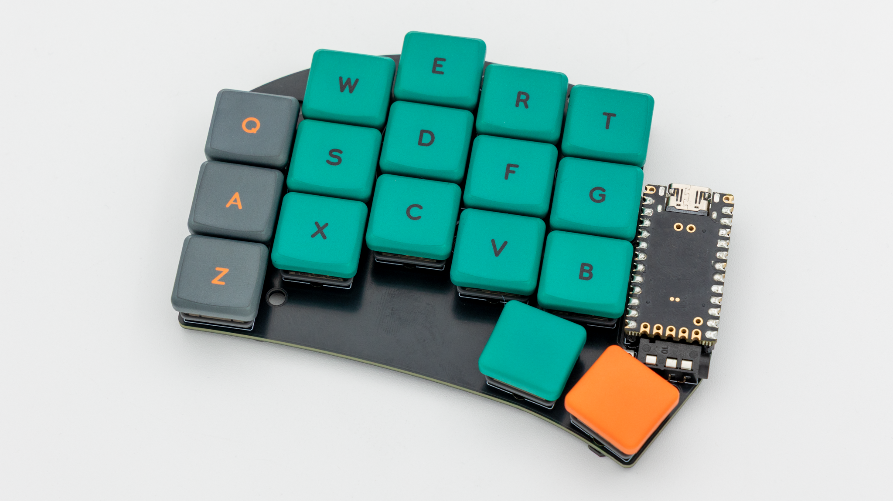

## Soldering

If you do not have experience with soldering, please referr to this [Quick Start guide]().


### General Assembly

First we will solder the parts that are the same on both the wired and wireless variants.

#### Reset Buttons

Solder on the reset buttons.

#### HotSwap Sockets

Solder on the hotswap sockets. You can find instructions for that [here]().

Please skip to [this part]() now if you are building a wireless Sweep.
 Please skip to [this part]() now if you are building a wired Sweep.

### Wireless

All of the steps in this paragraph need to be done when assembling the wireless variant of the Sweep.

#### Slide Switch

You will need to solder in the slide switch to be able to power the keyboard on or off. The switch is located on the back of the PCB.

#### Controller Standoffs

Next solder on the standoffs for your controller. You need to use IC sockets with MillMax pins for this board. Read through [here]() if you have not done that before.

#### Batteries

Solder in the batteries on the marked pins at the top.

#### Controller

Before soldering the controllers onto the PCB we should get your controller flashed.

Depending on which controller you use you will have to go about flashing them differently. You can find the firmware <a href="https://files.keeb.supply/firmware/DASBOB/" >here<a>. And instructions on how to flash a controller [here](). 

Solder the controller to the headers now. Instructions on how to do that can be found [here](). When you have the PCB in front of you, the USB port should go to the top of the PCB. You should not see the components of the controller, when it is sitting on the PCB.

You can now skip to the [Final Assembly]() to continue.

### Wired

All of the steps in this paragraph need to be done when assembling the wired variant of the Sweep.

#### TRRS Jacks

You will need to solder in the TRRS jacks.

#### Controller Standoffs

Next solder on the standoffs for your controller. You need to use IC sockets with MillMax pins for this board. Read through [here]() if you have not done that before.

#### Controller

Before soldering the controllers onto the PCB we should get your controller flashed.

You can find the firmware <a href="https://files.keeb.supply/firmware/sweep-bling-lp/" >here<a>. And instructions on how to flash a controller [here](). 

Plug in your controller now and see if it pops up in [VIAL]().

If it does you have successfully flashed your controller.

If your controller is working, you can solder it in. Instructions on how to do that can be found [here](). When you have the PCB in front of you, the USB port should go to the top of the PCB. You should not see the components of the controller, when it is sitting on the PCB.

When you have your controller soldered in, it is good practice to do a [matrix test](). Since the Sweep is a split keyboard, you need to plug in the two halves together using the TRRS cable.


You can now continue reading the Final Assembly to proceed.

## Final Assembly

Start by putting on the rubber feet. We provide 4 feet per side which you can place wherever you want.

After that push in the switches.

As a last step put on your keycaps.

And your Sweep keyboard is done!

