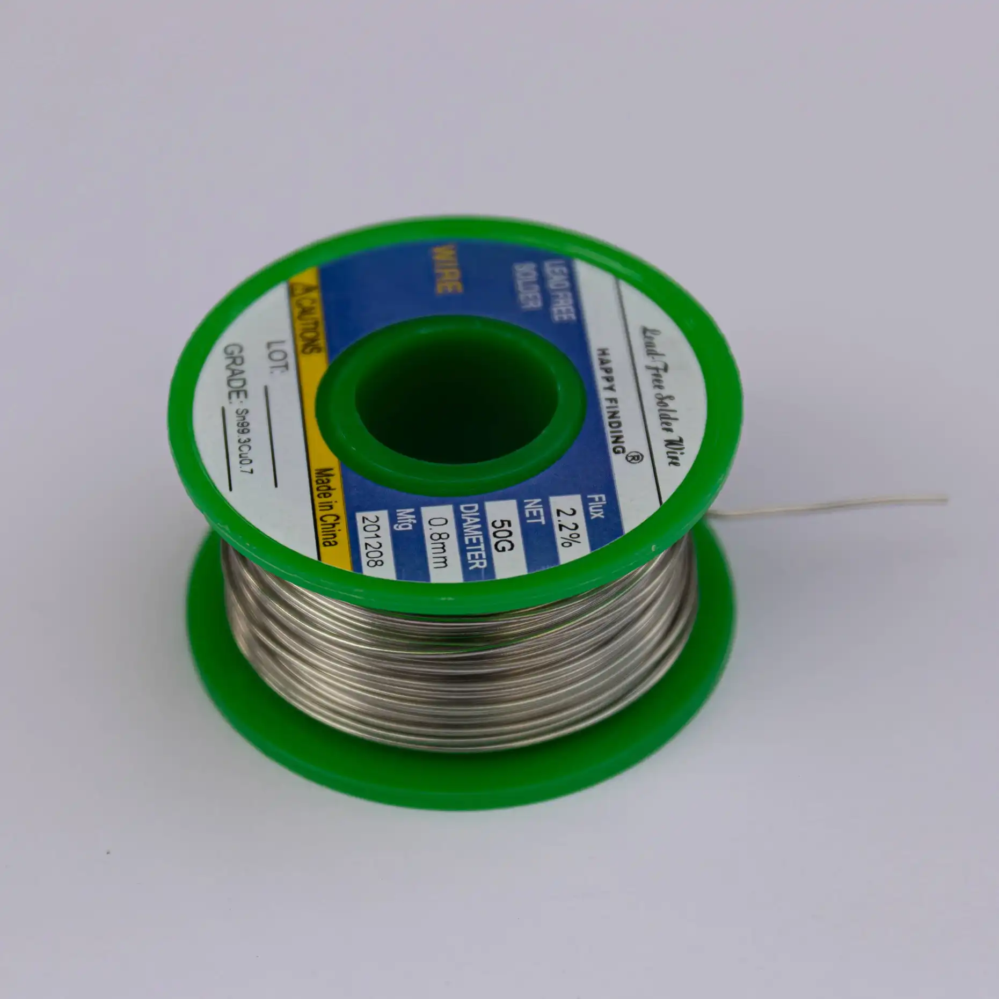

| Image                                  | Part                                     | Description                                                                                                                                  |
| -------------------------------------- | ---------------------------------------- | -------------------------------------------------------------------------------------------------------------------------------------------- |
|                                        |                                          |                                                                                                                                              |
|                   | 2 x ProMicro compatible micro controller | You will need to supply your own micro controllers and mounting for them. You can use a Helios for wired or a Nice!Nano for wireless builds. |
|  | soldering iron                           | We recommend a good soldering iron!                                                                                                          |
|                  | solder                                   | Please use high quality solder (flux core or apply flux externally) to make your life easier when soldering this kit!                        |
