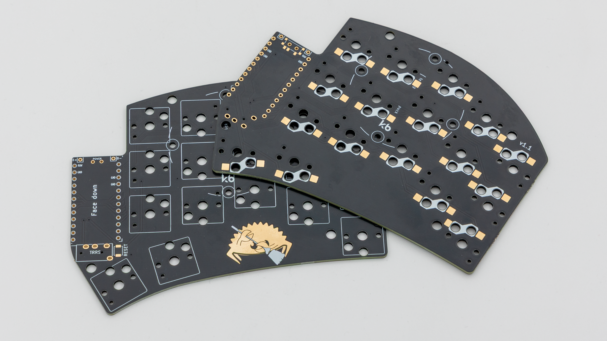
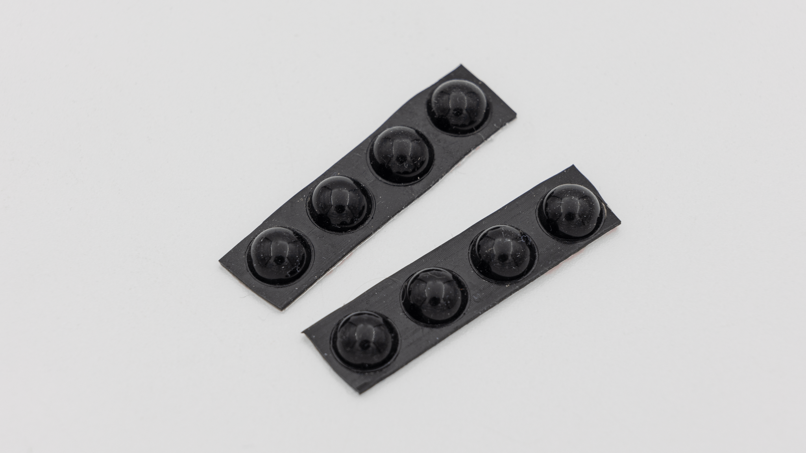
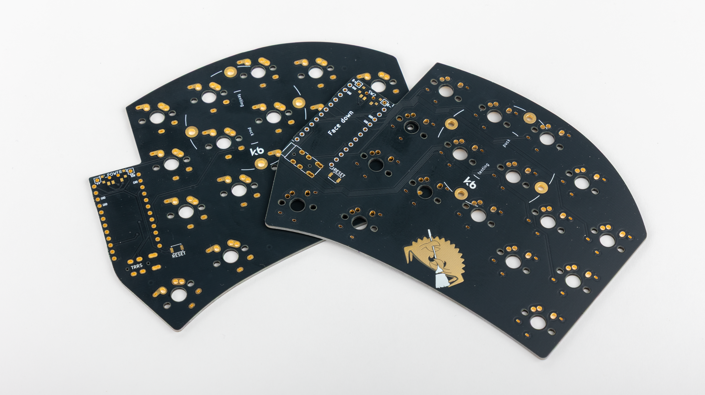
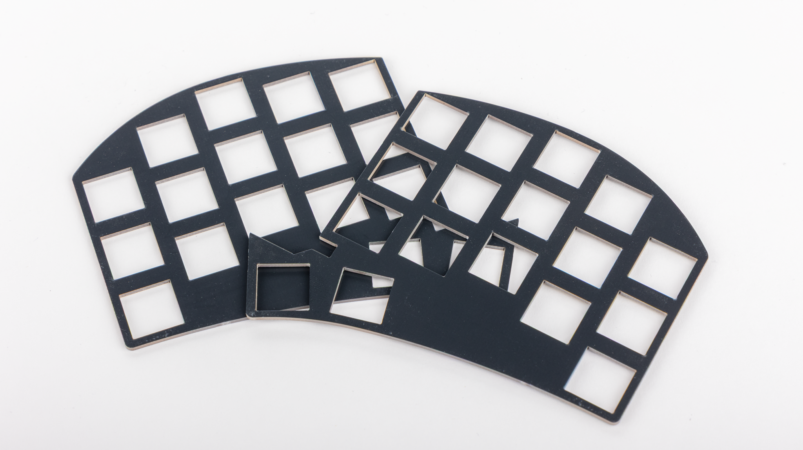
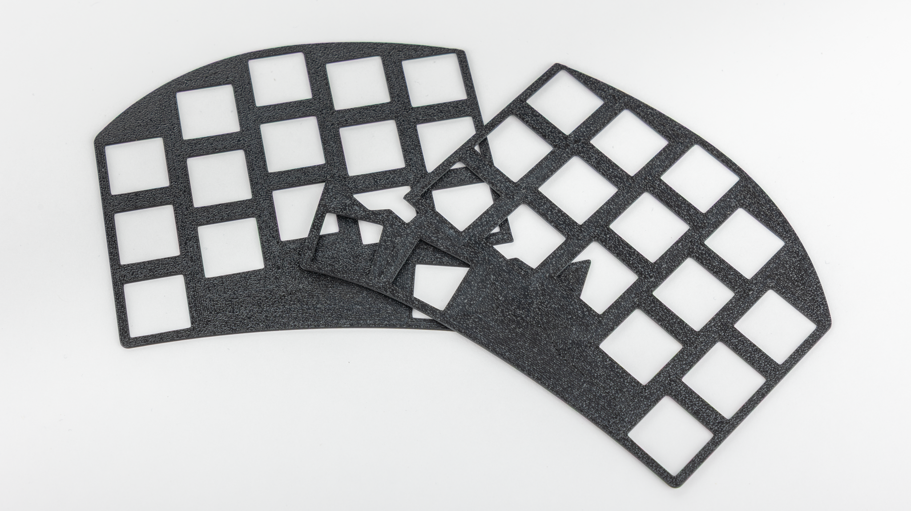
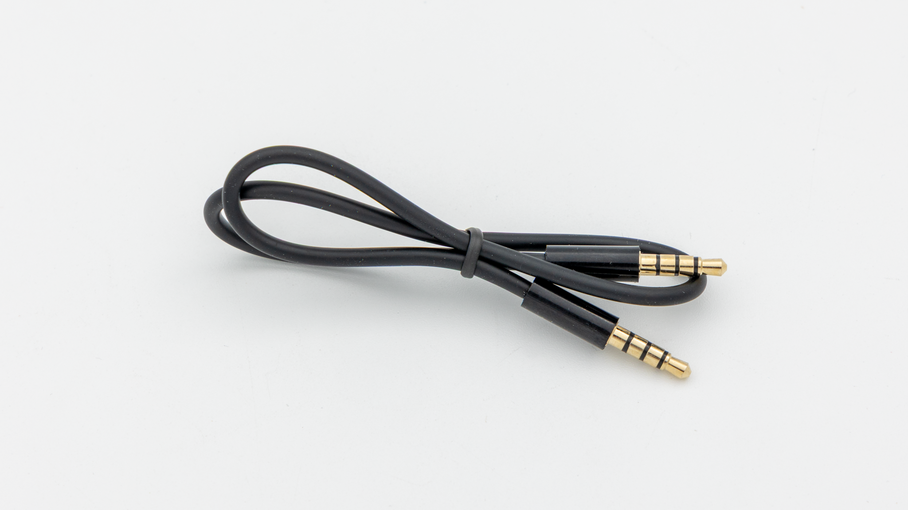

## Choc Switch Type

### Choc V1 Version

These parts are included in all Choc V1 versions of the kit.
| Image | Description | Quantity |
| ----------------------------- | --------------- | -------- |
| |
|  | PCB | 2 |
|  | Rubber Feet | 8 |
|  | Reset Buttons | 2 |
|  | Hotswap Sockets | 35 |

### Choc V2 Version

These parts are included in all Choc V2 versions of the kit.
| Image | Description | Quantity |
| ----------------------------- | --------------- | -------- |
| |
|  | PCB | 2 |
|  | Plate | 2 |
|  | Plate Riser | 2 |
|  | Rubber Feet | 8 |
|  | Reset Buttons | 2 |

## Wired/Wireless Version

Depending on the version, there will be different parts included in the kit.

### Wired Version

| Image                    | Description | Quantity |
| ------------------------ | ----------- | -------- |
|                          |
|    | TRRS jack   | 2        |
|  | TRRS cable  | 1        |

### Bluetooth Version

| Image                       | Description  | Quantity |
| --------------------------- | ------------ | -------- |
|                             |
|  | Slide Switch | 2        |


