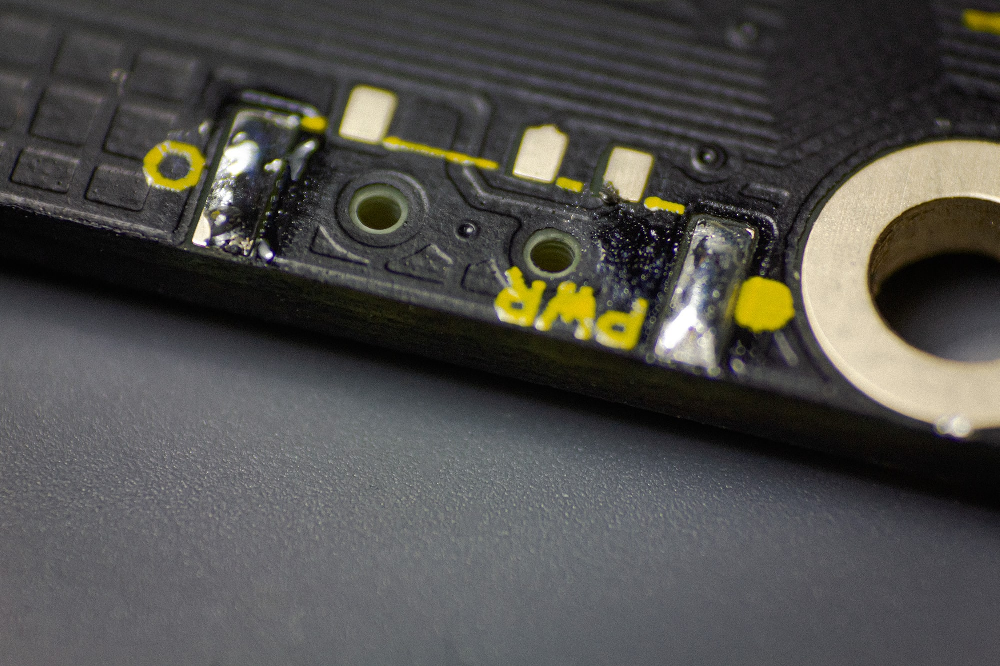
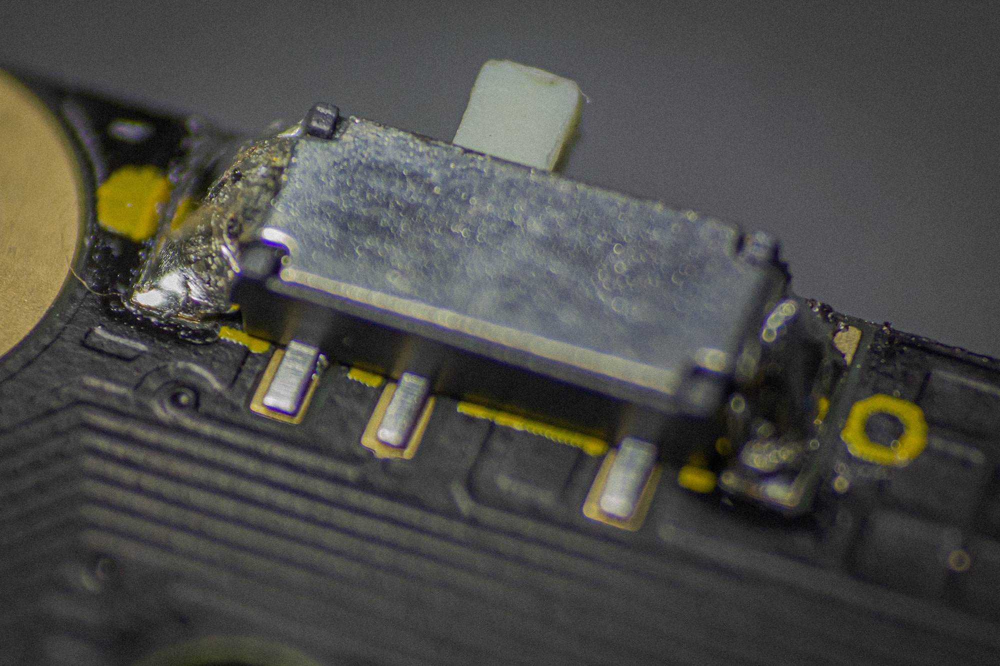
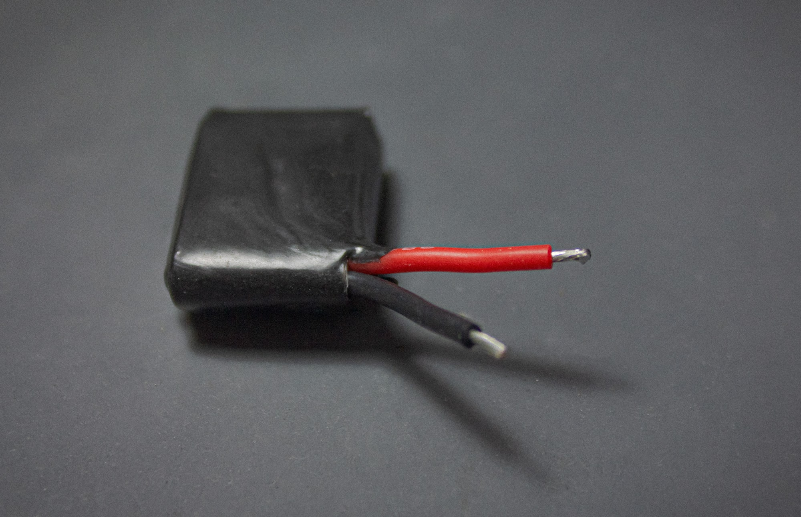
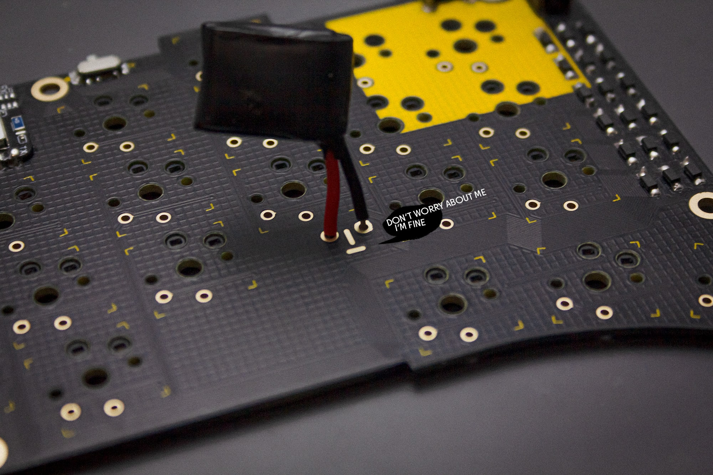
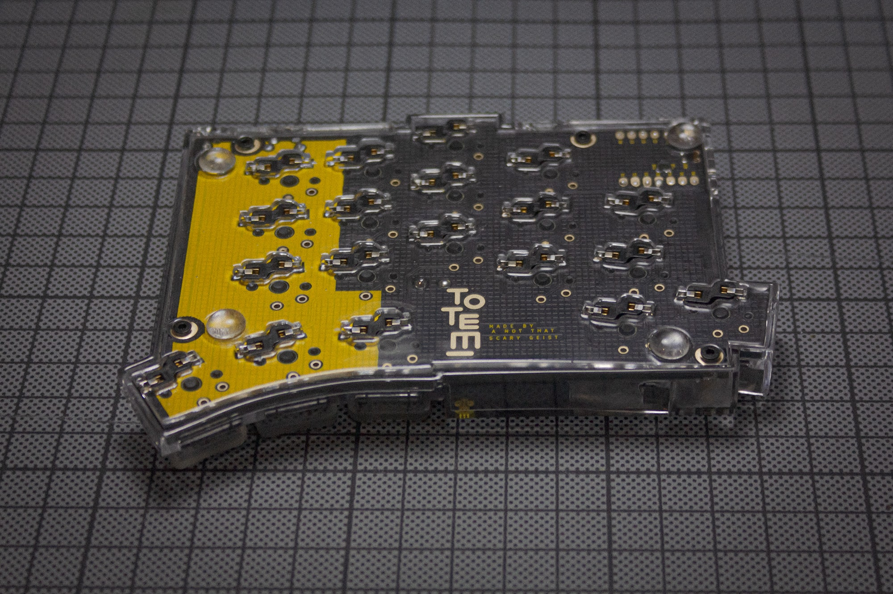

## SOLDERING

Here is an overview of where and on which side each component needs to be soldered. 

### GENERAL

#### DIODES

The diodes needs to be soldered on the top of the PCB. Pay attention to their orientation: They have a small line on one side, which should be on the side the arrow on the PCB is facing to. 

 Apply a small amount of solder on one pad.

 Then use tweezers to place the diode on the pads and reheat the solder to secure the diode.

Now you can add solder to the second pad.



#### HOTSWAP SOCKETS

Here you can apply the same technique as used for the diodes: Apply some solder on one of the pads first.

 Then place the switch socket in the silk screen markings. The orientation matters here too. Especially if you plan on using the case.

 Than reheat the solder. Apply some pressure with a pair of tweezers to make sure the socket is fully seated.

Now you can add solder to the second pad.

#### RESET BUTTON

Insert the button into the top of the PCB.

 We placed the fooprint a bit more towards the edge, than it's meant to be, to integrate it better into the case. Therefore the tiny stabilizer on the bottom of the switch doesn't touch the PCB anymore. Make sure it aligns with the PCB vertically, so it's oriented correctly.

 Then solder the four pins on the bottom to the PCB.



#### MICROCONTROLLER



 Place the microcontroller in it's place.
Apply some flux and try to hold the iron in an angle where you touch the pads of the microcontroller and the PCB, while adding solder.

 The pads on the back are a bit fiddly to solder, so you should add a lot of flux to the pads on the microcontroller first. Then apply the same technique as on the front: Try to touch the pads on the microcontroller and the PCB before adding solder.



### WIRED

You will only need to solder these parts, when building the wired version of the TOTEM.

#### TRRS JACKS

Install the TRRS jack on the bottom side of the PCB. The place where you should insert it is marked with a white line.

 You may want to use some masking or kapton tape to hold it in place, since you need to solder it on the bottom.

 Then solder the pins on the bottom to the PCB.



 Once you are done with the parts for the wired version you can skip to [here]() to continue.

### BLUETOOTH

You will only need to solder these parts, when building the wired version of the TOTEM.

#### POWER SWITCH

Apply a tiny bit of solder on the bigger, outer pads on top of the PCB.

 The power switch has some tiny knobs on its bottom, which fits into the PCB holes. Hold it in place with tweezers and than reheat the solder on the pad. After this you can solder the other pad and the three pins.

#### BATTERY



 You probably need to shorten the cables and tin them, since the length needs to be pretty short, to fit.



 You can see which cable needs to go in which eye by the silkscreen below the eyes. Red is + / Black is -.

 Attach the wires of the battery to the pads and solder them in.

 Once you are done with the parts for the bluetooth version you can skip to [here]() to continue.

### CLEANING

When you are done soldering, you should clean your PCB with isopropanol or PCB cleaner to make it look nice again.



## CASE



 First install the standoffs from below into the top of the case.

 Next screw them in from above.

 Now insert the board into the top and put in your switches. Be sure to support the hotswap sockets from below!

 Put in your rubber feet into the designated spots in the bottom piece.

 You can than attach the bottom to the case and screw it in.

## FINAL BUILD

This is how the final keyboard will probably look like.

