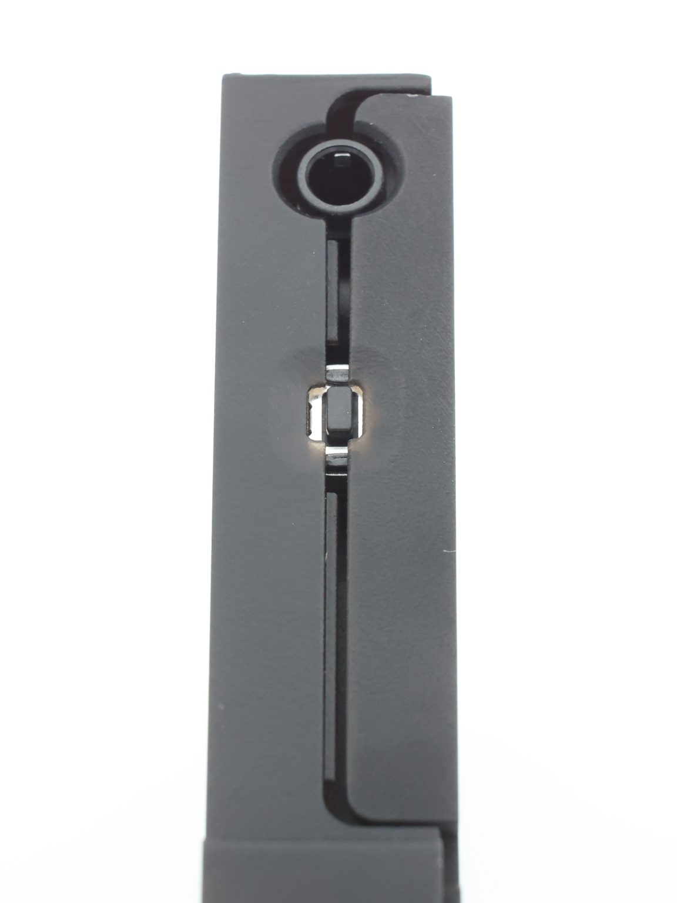

## PROBLEM

With the current round of cases, there was a problem with one of the holes for the standoffs being 1mm less deep than the rest of them. The 9mm standoffs used in some kits are too long for these holes. If you have 9mm standoffs in your kit, your case may look like the following.  
If this is the case, please replace said 9mm standoff with the 8mm standoff that we have included in every kit sold on KeebSupply. This will completely solve the problem. 

