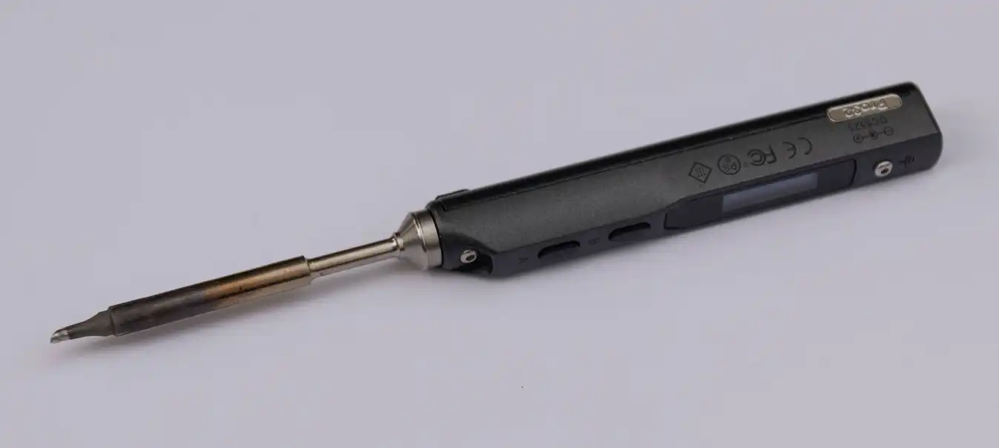

| Image                                  | Part           | Description                                                                                                           |
| -------------------------------------- | -------------- | --------------------------------------------------------------------------------------------------------------------- |
|                                        |                |                                                                                                                       |
|    | flush cutters  | You will need these to clip of some metal bits from some components.                                                  |
|  | soldering iron | We recommend a good soldering iron!                                                                                   |
|                  | solder         | Please use high quality solder (flux core or apply flux externally) to make your life easier when soldering this kit! |
