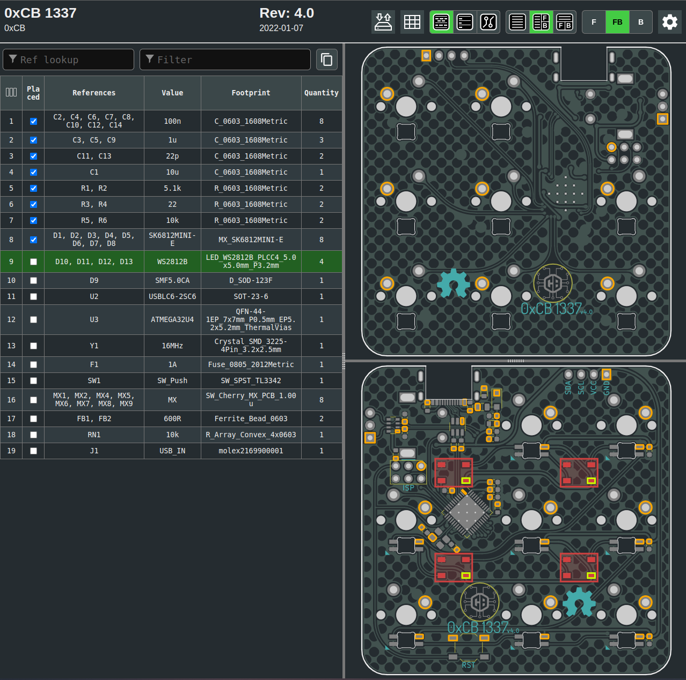
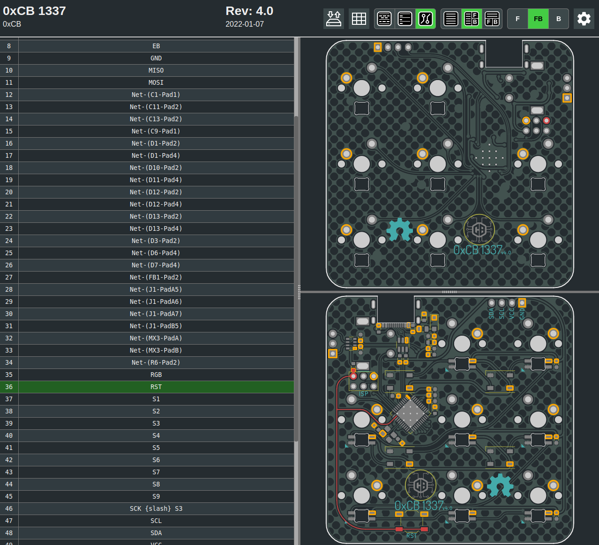
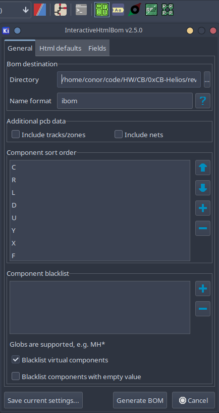

## Intro
The HumanPnp is a great tool to make populating PCBs, or fixing them a breeze.
It's a KiCAD plugin - you can find the git [here](https://github.com/openscopeproject/InteractiveHtmlBom).


This is an overview of the HumanPnP site - you can browse our HumanPnPs [here](https://files.0xcb.dev/):

## BOM
You get a BOM (Bill Of Materials) and the PCB view (You can toggle which side to display via the F, FB, and B buttons at the top right of the window).

As soon as you hover over a row in the BOM it will highlight all corresponding components - this makes it pretty straightforward to hand assemble an SMT PCB (after placing a component you can check the checkbox to not lose track of the components already placed).

## Nets

Another important feature is the Nets tab. it allows you to see all the different traces of the PCB and follow them through their layers.
This allows you to locate faults and assess repairs.

For example, you could imagine the reset trace is damaged somewhere between the ICSP 6-pin header and the Atmega chip.
You also see that the reset switch is connected to the net.

With that knowledge, you can exclude the fault region by measuring from:
- chip to header
- header to switch
- switch to chip

You came to the conclusion, that the trace is broken between the header and switch, and also to the Chip, but the Switch to Chip is fine.

This means, that the trace has to be broken just after the junction goes to the header from the chip/switch and an easy fix would be a botchwire from the switch to the header.

This method works for a lot of problems regarding PCBs.

Just select the net on the left and it will be highlighted in red on the PCB.

## Make your own

- First of all install the plugin from the PCM.
- Then open your PCB in KiCAD and you should see an new plugin in the topbar
- Open it and try it with default setting
- Then play with the setting until you like it



