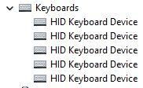
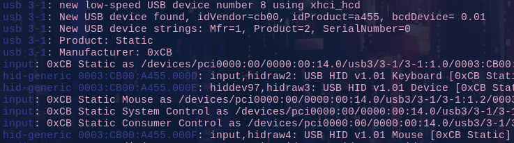
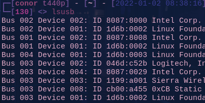

## Intro
Is your keyboard not working after you soldered everything? Most of the time the USB port has not had enough / too much solder and shorts out.
This applies to most through-hole kits...

Here are some simple steps you can follow to exclude different errors:

### Use a data cable

This shouldn't be a problem with USB-C but you never know...
### Check for USB warnings
If you see a warning that the device is not recognized or draws too much power you may continue with the steps below. Otherwise, you should try to reflash the [firmware]().

### Look for USB devices
Check Device manager on Windows:

or `dmesg -w` on Unix-like distros when plugging in your board:

you can also use `lsusb` on Linux to check for USB devices specifically:

The ones above are good examples of what it should look like -  if you don't see anything, or error messages and you tried to reflash then you should look into the solder joints.

### Bad soldering

Maybe just one solder joint is missing a tad bit of solder and your whole board won't work.
Please refer to our solder guide [here]().

### Still broken?

Please don't refrain from contacting us for help :)
