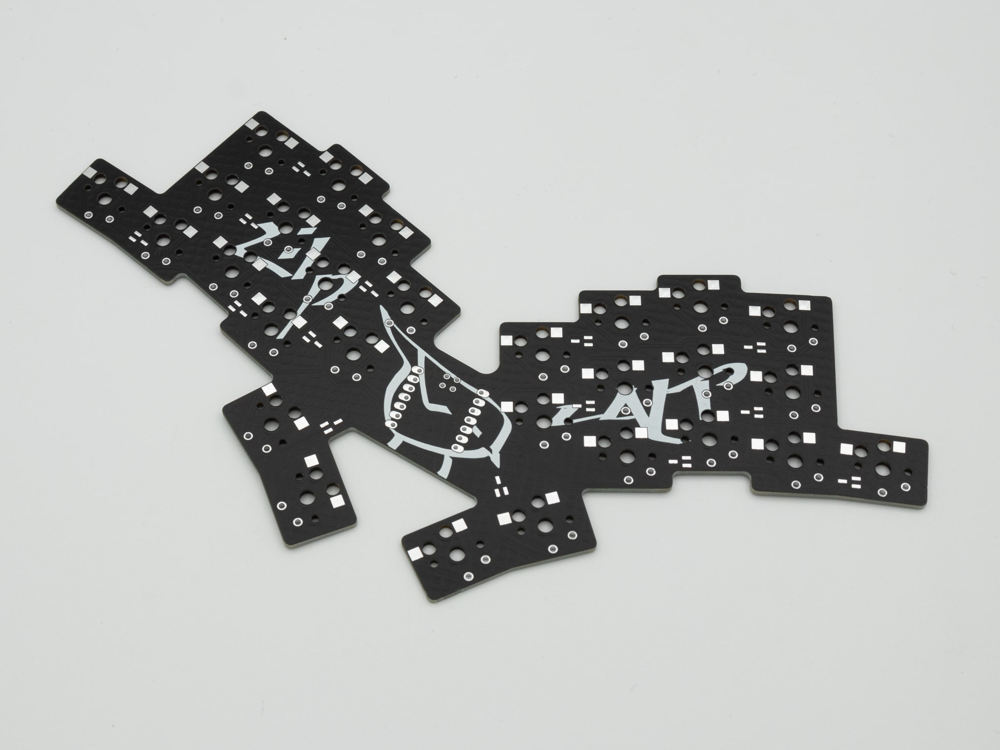
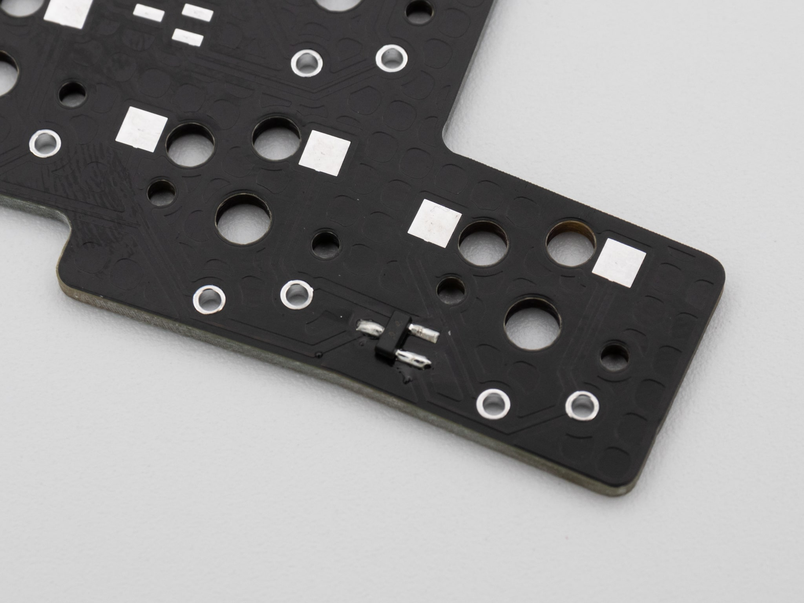
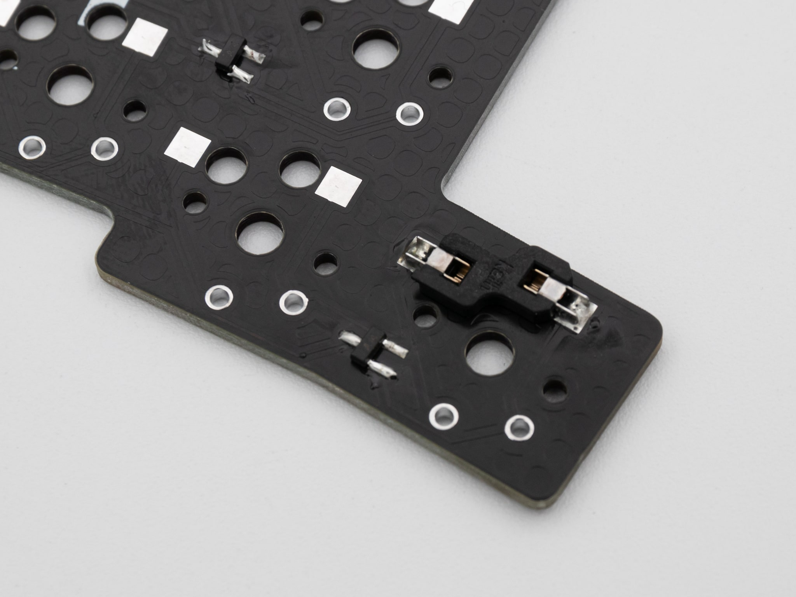
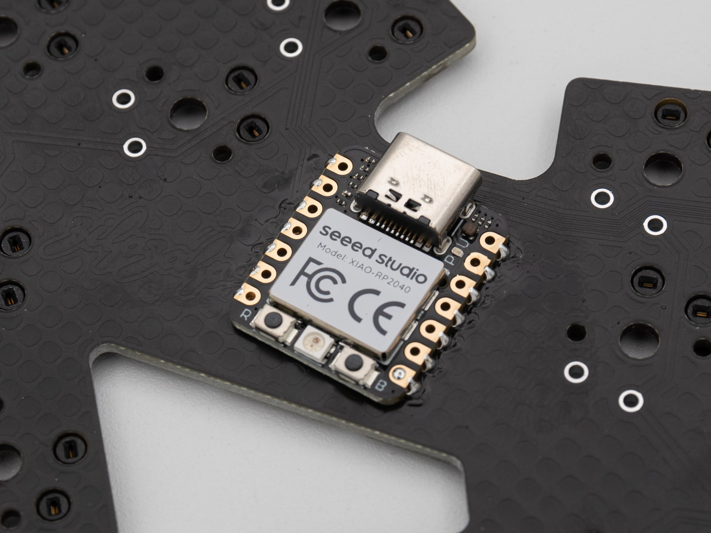
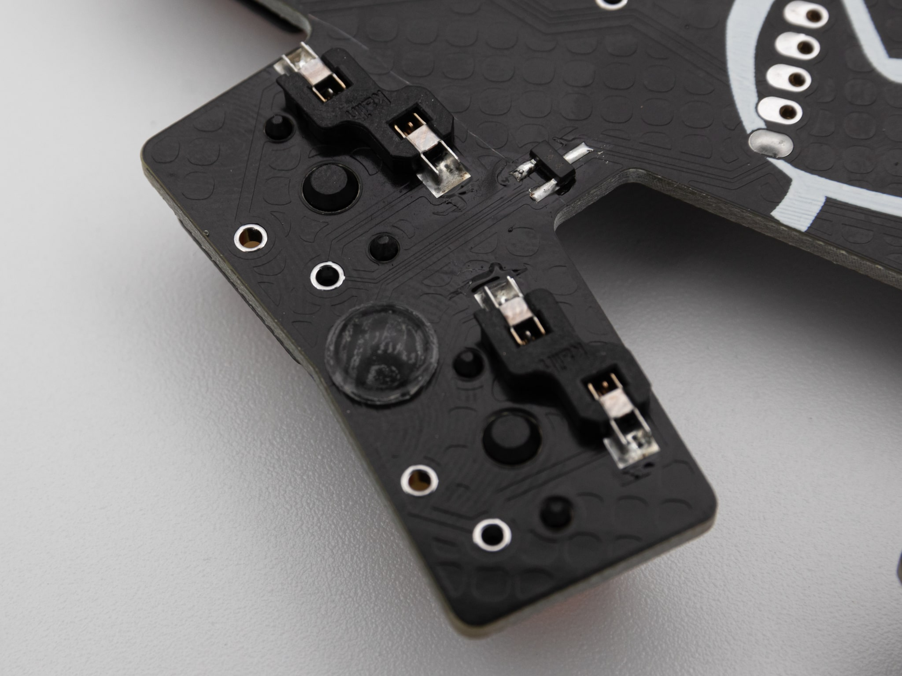
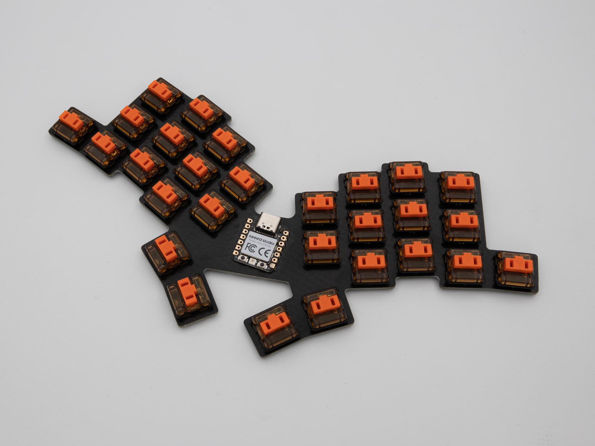
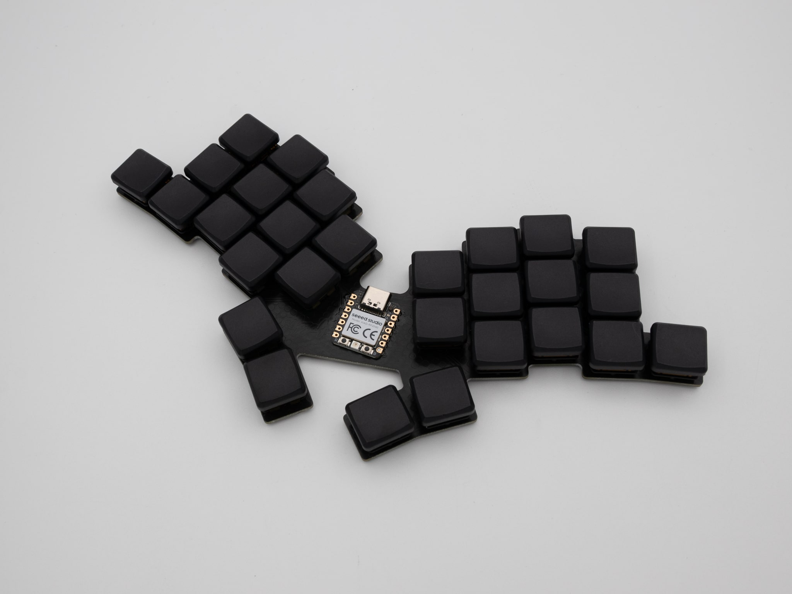

 Let's start the assembly with the PCB.



 You can start by soldering on your diodes. You can find Instructions on how to solder diodes [here]().

 After that you can solder on your hotswap sockets. These are optional, as you can also solder in the switches, but sockets are included in the kit from KeebSupply. You can find Instructions on how to solder hotswap sockets [here]().

 After that you just have to solder on your Controller. You can lay the Seeed XIAO directly onto the PCB and solder it on there. You can find Instructions on how to solder a controller directly onto the PCB [here]().

 You can put on your rubber feet where ever you want on the PCB. You will have to cut the rubber feet to make them fit onto the PCB.

 After that put in your switches. If you soldered on the hotswap sockets, you can just push them in, otherwise you will have to solder them in.

 Now just put on your keycaps and you are done with your Zilpzalp!

 A VIAL firmware for the Zilpzalp is available [here](https://files.keeb.supply/firmware/Zilpzalp/). If you want to dive deaper into the firmware side of things check out the [GitHub](https://github.com/kilipan/zilpzalp). Also note our [Example Keymaps]() for getting started. If you want to learn more about small keyboards in general, check out our [Intro to Small Keyboards]().