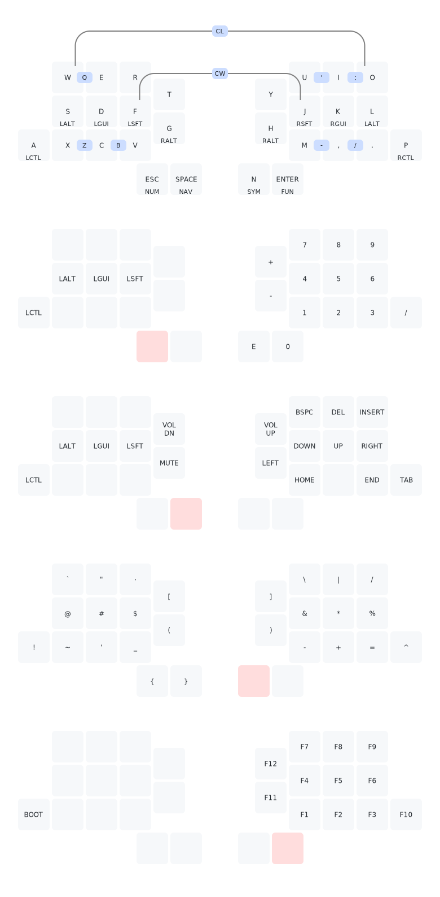
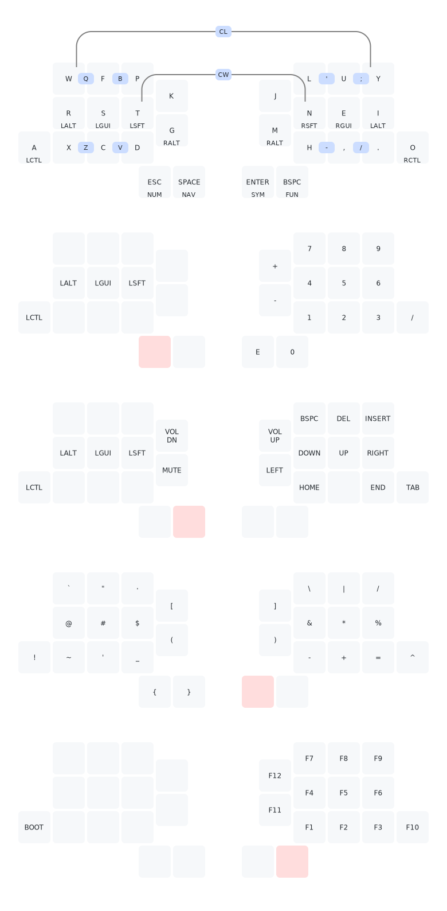
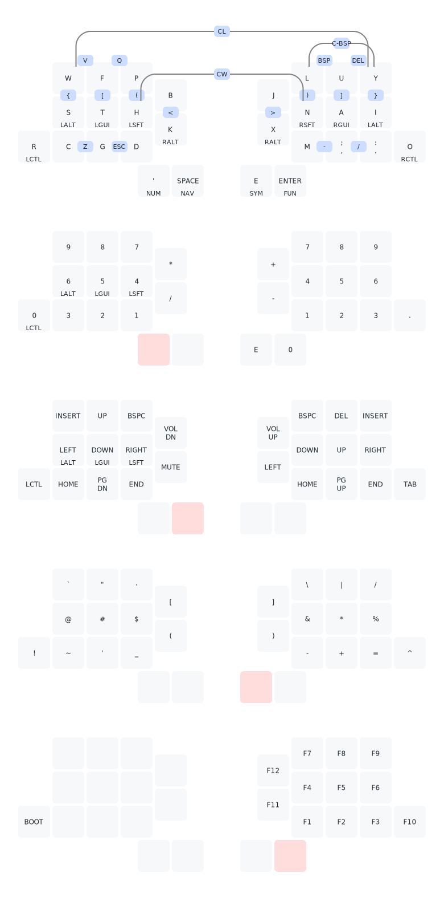

## Overview
Here you can find three example keymaps that have been adapted to the Zilpzalp: Qwerty, Colemak (mod DH), and Aptmak.

For starters, you may want to choose Qwerty or Colemak if you are familiar with one of them.
The [Aptmak](https://github.com/apsu/aptmak) keymap was created by [Apsu](https://github.com/apsu) and was an inspiration for the reduced number of keys on the Zilpzalp.
If you are interested in a very optimized experience and are up for the learning curve, feel free to try it out!

### Zilpzalp'd Qwerty

### Zilpzalp'd Colemak

### Zilpzalp'd Aptmak

