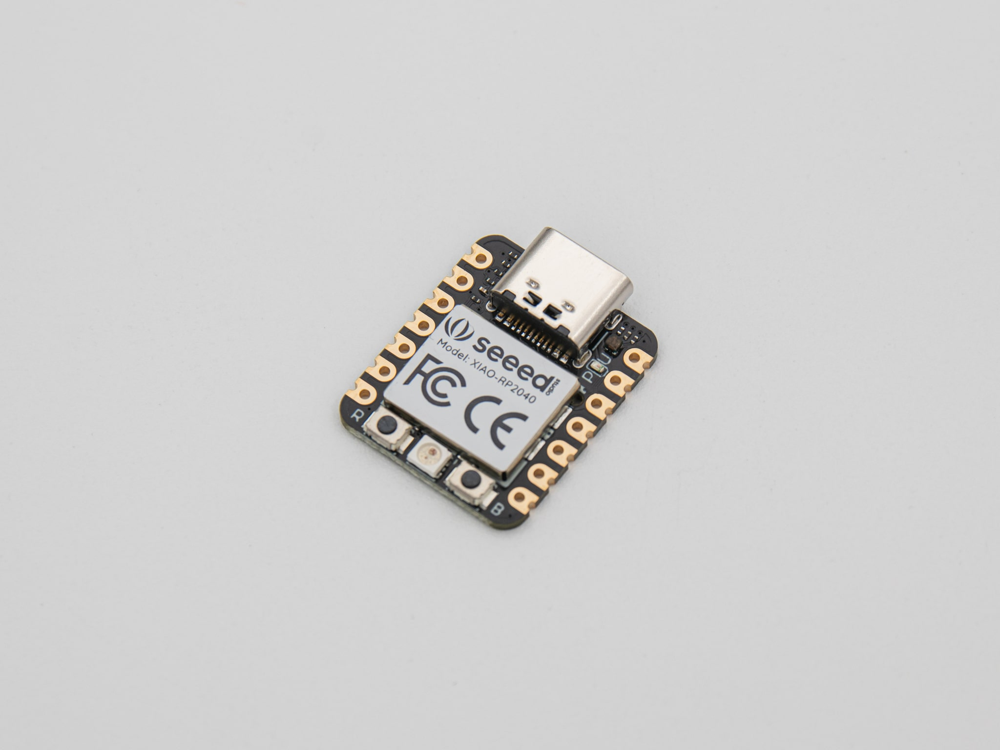

| Image                                  | Part              | Description                                                                                                           |
| -------------------------------------- | ----------------- | --------------------------------------------------------------------------------------------------------------------- |
|                                        |                   |                                                                                                                       |
|                     | Seeed XIAO RP2040 | The controller isn't included in the kit.                                                                             |
|  | soldering iron    | We recommend a good soldering iron!                                                                                   |
|                  | solder            | Please use high quality solder (flux core or apply flux externally) to make your life easier when soldering this kit! |