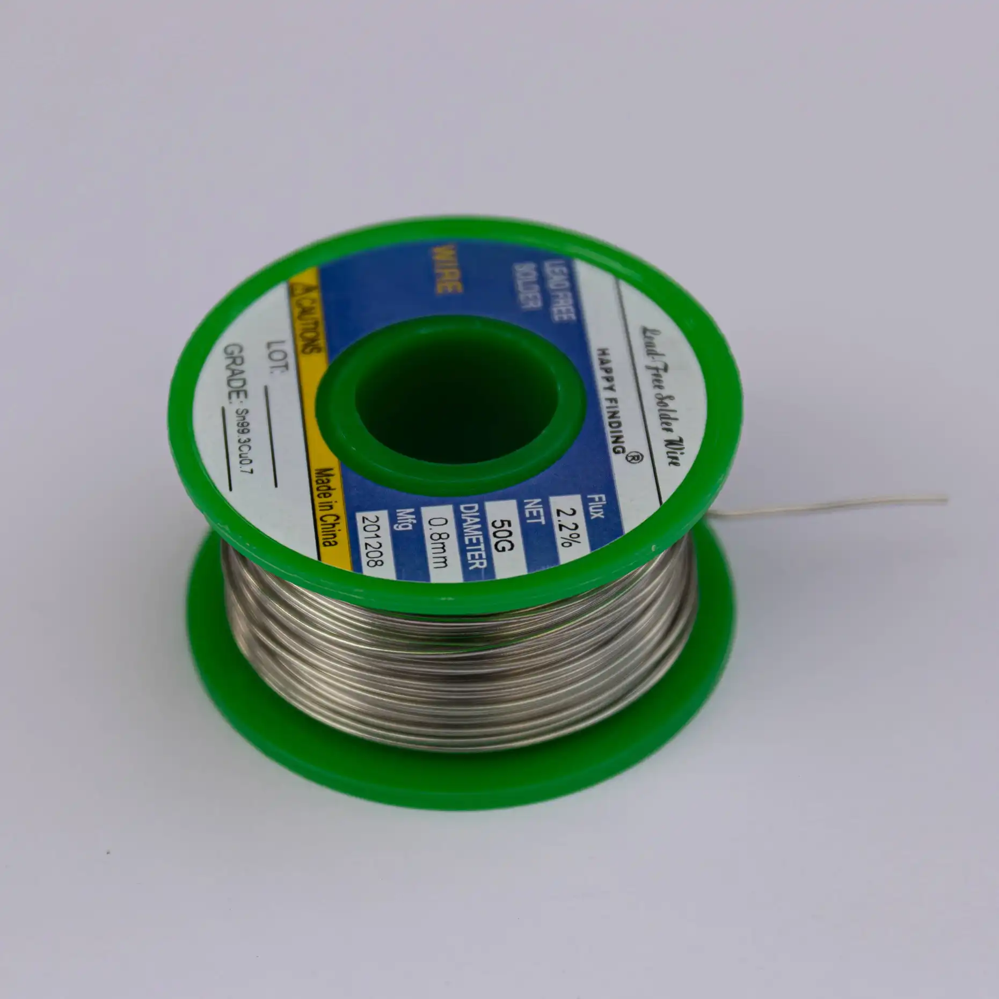

| Image                                  | Part           | Description                                                                                                           |
| -------------------------------------- | -------------- | --------------------------------------------------------------------------------------------------------------------- |
|                                        |                |                                                                                                                       |
|  | soldering iron | We recomment a good soldering iron! Don't expect a challenge tho, the soldering on the 1337 is rather simple.         |
|                  | solder         | Please use high quality solder (flux core or apply flux externally) to make your life easier when soldering this kit! |